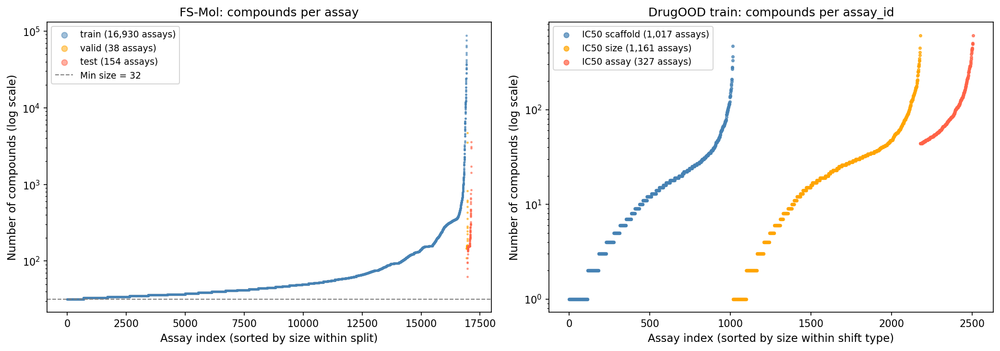
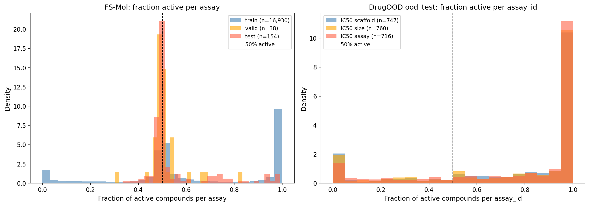
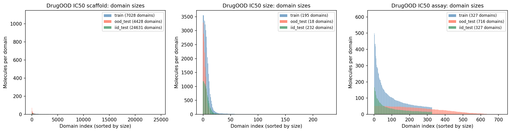
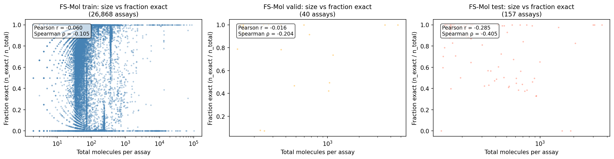
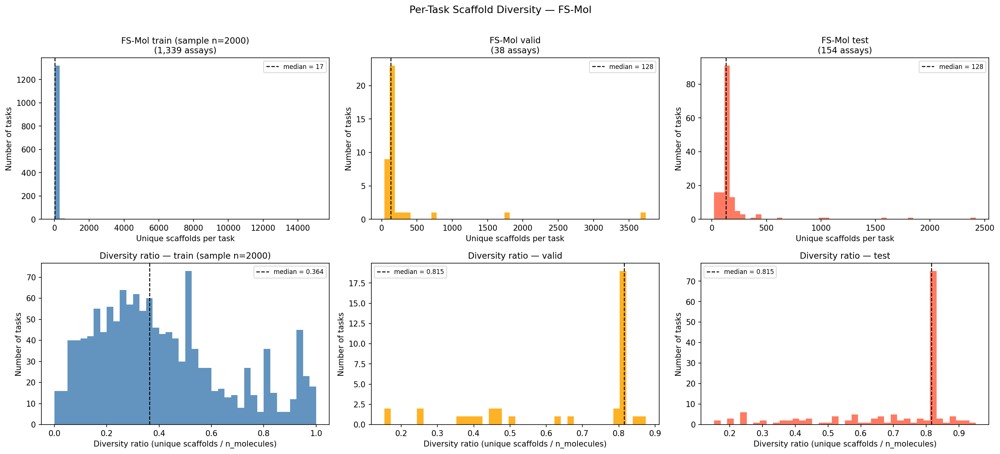

# Data Analysis

Scripts for auditing the FS-Mol and DrugOOD datasets before and independently of any model training. All scripts read paths from `config.py` and write outputs to `FIGURES_DIR` / `RESULTS_DIR`.

For model evaluation results, training configuration, and comparison figures, see [Analysis/model/README.md](../model/README.md) and the [main README](../../README.md).

---

## Scripts

### `dataset_overview.py`

Full data audit across all three FS-Mol splits and all three DrugOOD shift files.

**What it does:**
- Scans every FS-Mol `.jsonl.gz` assay file, counts raw / inexact / invalid / exact molecules per assay
- Reports what fraction of each assay survives the `Relation == "="` filter and the `MIN_TASK_SIZE=32` filter
- Computes fraction-active per assay (the random-classifier baseline for ΔAUPRC)
- Reports DrugOOD per-assay split sizes (train / iid_test / ood_test per shift type)

**Outputs:**

| File | Description |
|---|---|
| `results/assay_sizes_fsmol.csv` | Per-assay molecule counts for all FS-Mol splits |
| `results/data_loss_per_assay.csv` | Per-assay inexact / invalid drop counts |
| `figures/fig1a_assay_sizes.png` | Assay size distributions (train / valid / test) |
| `figures/fig1b_fraction_actives.png` | Fraction-active distribution across assays |
| `figures/fig1c_domain_sizes.png` | DrugOOD domain size distributions |
| `figures/fig_size_vs_fraction_exact.png` | Assay size vs fraction of exact measurements |

```bash
python Analysis/data/dataset_overview.py
```

---

### `scaffold_analysis.py`

Per-task Bemis-Murcko scaffold diversity across all FS-Mol splits.

**What it does:**
- For each assay passing `MIN_TASK_SIZE=32`, computes number of unique Murcko scaffolds and scaffold diversity ratio (`n_unique_scaffolds / n_molecules`)
- Runs on test + valid (full scan) and train (sampled, default 2000 files)
- Histogram plots for both metrics per split

**Outputs:**

| File | Description |
|---|---|
| `results/scaffold_diversity_per_task_all_splits.csv` | Per-assay scaffold diversity for all splits |
| `figures/fig_scaffold_diversity_per_task.png` | Histogram grid: unique scaffolds and diversity ratio |

```bash
python Analysis/data/scaffold_analysis.py
```

---

### `structural_variability.py`

**Library file — not run directly.** Imported by `chemical_diversity.py`.

Provides molecule-level feature computation via RDKit:

| Function | Description |
|---|---|
| `compute_mol_features(smiles)` | Molecular mass, heavy atom count, rotatable bonds, aromatic rings, generic scaffold |
| `compute_structural_variability(smiles_list)` | Applies the above to a list, returns a DataFrame |
| `summarize_variability(df)` | Prints mean / std / range summary |

---

### `chemical_diversity.py`

Chemical space comparison between FS-Mol and DrugOOD. Three complementary analyses.

**What it does:**

| Section | Description |
|---|---|
| 1 — Molecular properties | Mean molecular mass, heavy atoms, rotatable bonds, aromatic rings for FS-Mol train/test and DrugOOD train/ood_test. Reports generic scaffold overlap between datasets. |
| 2 — Tanimoto distances | Pairwise Tanimoto distance distributions: FS-Mol internal, DrugOOD internal, cross-dataset. Higher cross-distance = more chemical shift. |
| 3 — t-SNE | 2D projection of 5000 FS-Mol + 5000 DrugOOD molecules using ECFP4 with Tanimoto metric. |

**Outputs:**

| File | Description |
|---|---|
| `results/structural_var_comparison.csv` | Mean molecular properties per dataset |
| `figures/tanimoto_distances.png` | Tanimoto distance distribution histogram |
| `figures/tsne_fsmol_vs_drugood.png` | t-SNE coloured by dataset source |

```bash
python Analysis/data/chemical_diversity.py
```

---

## Dataset Statistics

### FS-Mol — Data Loss After Filtering

Only molecules with `Relation == "="` (exact measurements) are kept. Assays with fewer than 32 exact molecules are dropped entirely.

| Split | Raw molecules | Inexact dropped | Bad/missing | Task-too-small | **Used** | Tasks kept |
|---|---|---|---|---|---|---|
| Train | 5,038,727 | 1,928,837 (38.3%) | 134,751 (2.7%) | 162,246 (3.2%) | **2,812,893 (55.8%)** | 16,930 / 26,868 (63%) |
| Valid | 19,008 | 2,266 (11.9%) | 83 (0.4%) | 36 (0.2%) | **16,623 (87.5%)** | 38 / 40 (95%) |
| Test | 56,220 | 12,429 (22.1%) | 129 (0.2%) | 0 (0.0%) | **43,662 (77.7%)** | 154 / 157 (98%) |

The train split has the highest inexact fraction (38.3% censored), compared to 22.1% in test and 11.9% in valid. 37% of train assays are too small to use after filtering, leaving 16,930 usable training tasks.

### FS-Mol — Assay Size Distribution (after filtering, ≥32 molecules)

| Split | Tasks | Mean | Median | Min | Max |
|---|---|---|---|---|---|
| Train | 16,930 | 166 | 44 | 32 | 88,353 |
| Valid | 38 | 437 | 157 | 109 | 4,697 |
| Test | 154 | 284 | 157 | 63 | 3,594 |

Test and valid assays are ~3.5× larger than train (median 157 vs 44). Test/valid are curated, larger ChEMBL assays; train includes many small assays that barely pass the size filter. The ΔAUPRC drop at support sizes 256/512 in evaluation is partly due to selection bias — only very large assays qualify at those sizes.

**Assay size vs fraction-exact correlation:**

| Split | Pearson r | Spearman ρ | p-value |
|---|---|---|---|
| Train | −0.060 | −0.106 | < 0.001 |
| Valid | −0.016 | −0.204 | 0.21 (n.s.) |
| Test | −0.285 | **−0.405** | < 0.001 |

Larger assays tend to have a lower fraction of exact measurements — significant in train and test, not in valid (only 40 assays).

### DrugOOD — Per-Assay Size Summary

| Shift | Split | Assays | Mean molecules | Median | Min | Max |
|---|---|---|---|---|---|---|
| Scaffold | train | 1,017 | 21.7 | 12 | 1 | 467 |
| Scaffold | iid_test | 1,195 | 26.3 | 16 | 1 | 435 |
| Scaffold | ood_test | 747 | 26.1 | 12 | 1 | 307 |
| Size | train | 1,161 | 32.3 | 20 | 1 | 604 |
| Size | iid_test | 1,055 | 12.1 | 7 | 1 | 192 |
| Size | ood_test | 760 | 22.1 | 9 | 1 | 357 |
| Assay | train | 327 | 106.9 | 71 | 44 | 610 |
| Assay | iid_test | 327 | 36.6 | 25 | 15 | 204 |
| Assay | ood_test | 716 | 27.2 | 29 | 1 | 52 |

Many DrugOOD assays have as few as 1 molecule in some splits. These produce NaN ΔAUPRC (cannot rank a single molecule). The assay shift has the largest and most consistent train assays (median 71), which likely explains why it shows the best generalisation performance in model evaluation.

---

## Figures

**Figure 1(a) — Assay size distributions (train / valid / test):**



**Figure 1(b) — Fraction-active distribution across assays:**



**Figure 1(c) — DrugOOD domain size distributions:**



**Figure — Assay size vs fraction of exact measurements:**



**Figure — Per-task scaffold diversity across splits:**



**Figure — Tanimoto distance distributions and t-SNE chemical space (FS-Mol vs DrugOOD):**

> Run `python Analysis/data/chemical_diversity.py` to generate these figures.
