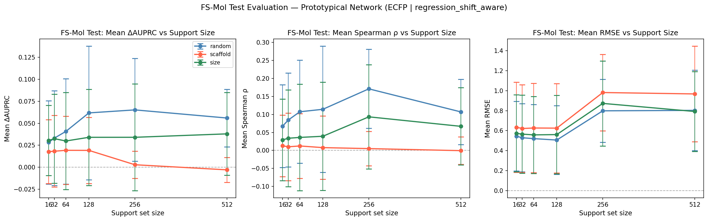
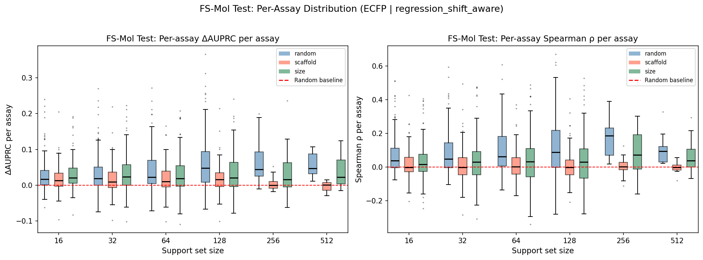
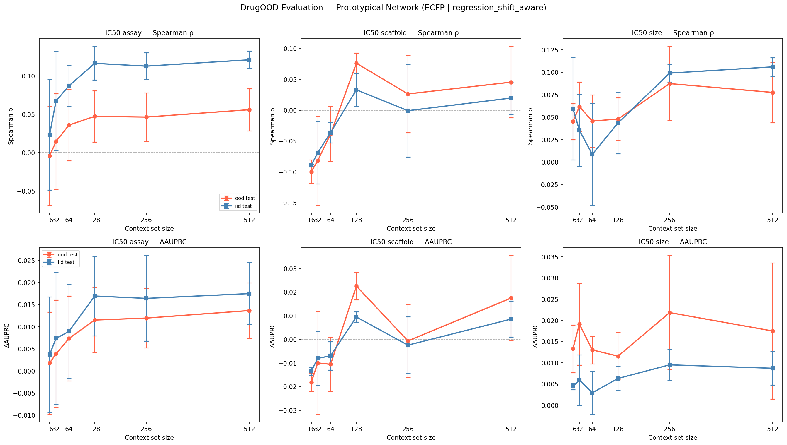
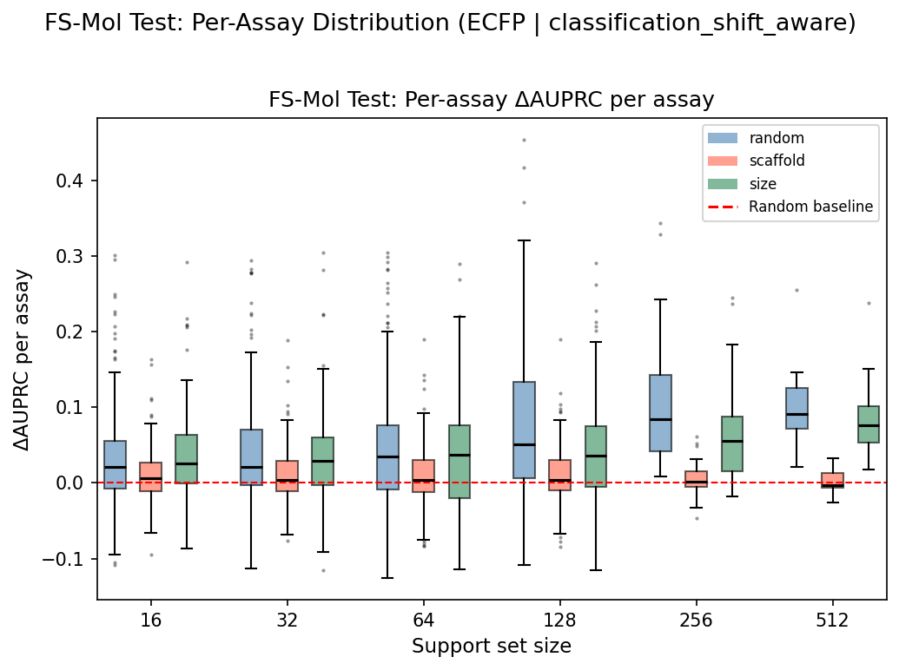
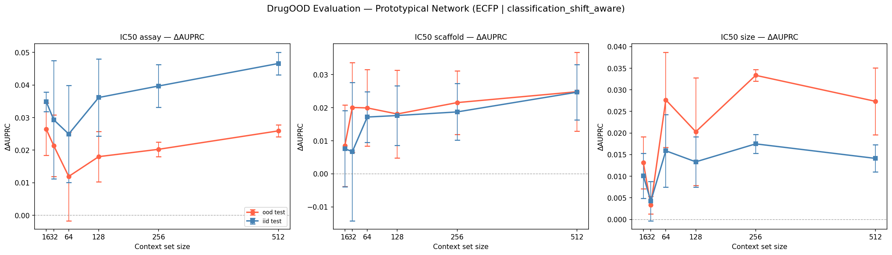
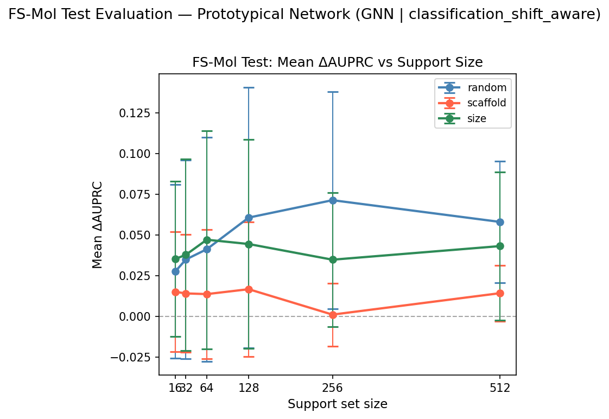
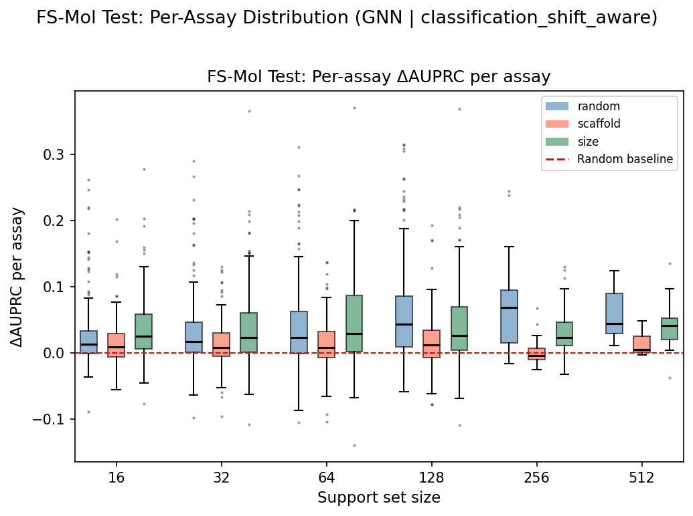
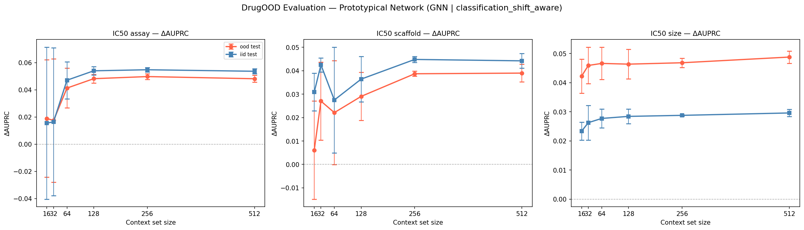
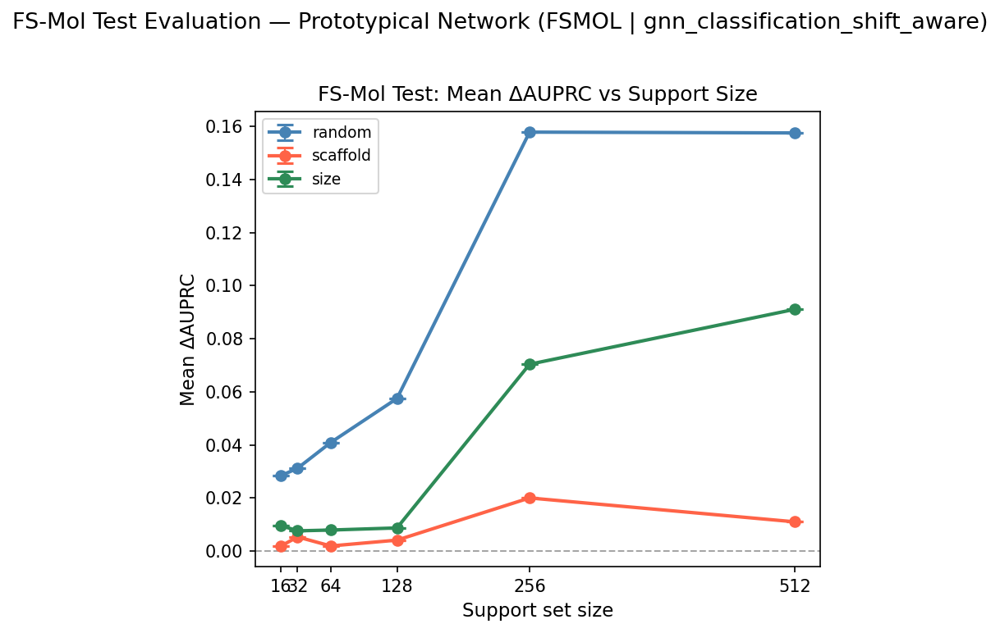
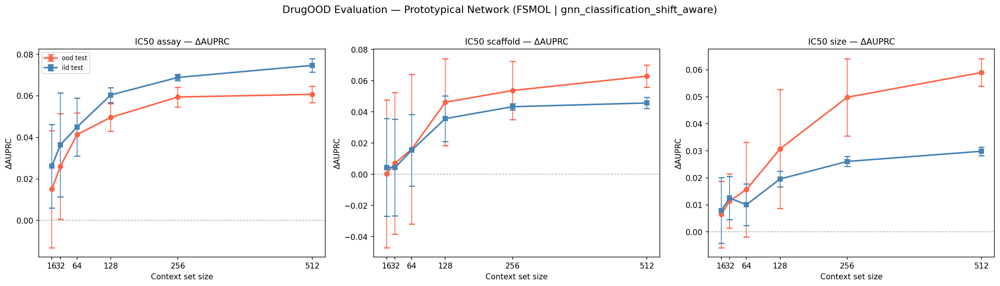

# Model Analysis

Scripts for evaluating trained models and generating result figures. All scripts read paths from `config.py` and write outputs to `FIGURES_DIR` / `RESULTS_DIR`. Run after `main.py` has produced the evaluation CSVs.

---

## Scripts

### `plot_results.py`

Generates all result figures for a given model run from the CSVs produced by `main.py`.

**Usage:**

```bash
python Analysis/model/plot_results.py --run_tag fsmol_gnn_classification_shift_aware
# or by components:
python Analysis/model/plot_results.py --encoder fsmol_gnn --head classification --split shift_aware
```

**Figures generated:**

| Figure | Description |
|---|---|
| `fig2a_fsmol_line_plot_{run_tag}.png` | ΔAUPRC vs support size, one line per split type (random / scaffold / size). Spearman ρ and RMSE panels included for regression only. Error bars = ±1 std across assays. |
| `fig2b_fsmol_boxplot_{run_tag}.png` | Per-assay ΔAUPRC distribution across support sizes. Available only when per-assay CSV data exists locally. |
| `fig3_drugood_line_plot_{run_tag}.png` | ΔAUPRC vs context size for each DrugOOD shift type, OOD and IID as separate lines. |

---

### `diagnostic_baseline.py`

Compares a pretrained PTN against simple baselines (mean-label, kNN k=1/3/5, KR-Tanimoto α=0.01/0.1/1.0) on the same episodes.

```bash
python Analysis/model/diagnostic_baseline.py
```

---

## Training Configuration

Two training regimes across the 4 runs. Critical context for interpreting results.

| Regime | Runs | Training pool | Notes |
|---|---|---|---|
| **Pool-based (old)** | Runs 1, 2, 3 | 62 assays (regression) or 21 assays with ≥320 molecules (GNN) | Fast iteration; severely limited task diversity |
| **Streaming (new)** | Run 4 | All ~16,930 usable FS-Mol train assays, streamed from disk | Correct regime; matches FS-Mol paper |

---

## Results

### Run 1: ECFP + Regression Head — Shift-Aware, Pool-Based

> **Encoder:** ECFP4 2048-bit → 3-layer MLP → 256-dim  
> **Training:** Pool-based, 62-assay pool, lr=1e-3, n_support=16, n_query=16, n_episodes=1000  
> **Best checkpoint:** epoch 15, Val RMSE 0.5270  
> **Evaluation:** 154 FS-Mol test assays

#### FS-Mol Test — ΔAUPRC

| Support size | Random | Scaffold | Size |
|---|---|---|---|
| 16 | 0.0283 | 0.0177 | 0.0305 |
| 32 | 0.0331 | 0.0182 | 0.0325 |
| 64 | 0.0408 | 0.0192 | 0.0298 |
| 128 | 0.0618 | 0.0191 | 0.0340 |
| 256 | 0.0652 | 0.0028 | 0.0340 |
| 512 | 0.0560 | −0.0030 | 0.0379 |

#### FS-Mol Test — Spearman ρ (Random split)

| n=16 | n=32 | n=64 | n=128 | n=256 | n=512 |
|---|---|---|---|---|---|
| 0.067 | 0.085 | 0.107 | 0.114 | 0.171 | 0.107 |

**Inside-task OOD (scaffold split, n_support=16):** Mean ΔAUPRC = 0.038 across 153 assays.

#### DrugOOD — ΔAUPRC (IC50)

| Context size | Scaffold OOD | Scaffold IID | Size OOD | Size IID | Assay OOD | Assay IID |
|---|---|---|---|---|---|---|
| 16 | −0.0182 | −0.0135 | +0.0133 | +0.0045 | +0.0018 | +0.0037 |
| 32 | −0.0100 | −0.0080 | +0.0191 | +0.0059 | +0.0039 | +0.0074 |
| 64 | −0.0105 | −0.0069 | +0.0131 | +0.0029 | +0.0073 | +0.0090 |
| 128 | +0.0226 | +0.0095 | +0.0116 | +0.0063 | +0.0115 | +0.0170 |
| 256 | −0.0006 | −0.0024 | +0.0218 | +0.0095 | +0.0120 | +0.0164 |
| 512 | +0.0175 | +0.0086 | +0.0175 | +0.0087 | +0.0137 | +0.0175 |
| **Mean** | **0.0001** | **−0.0005** | **0.0161** | **0.0063** | **0.0084** | **0.0118** |

**Key observations:**
- Scaffold OOD is largely negative or near-zero (mean ≈ 0.000) — regression kernel with ECFP fails to generalise cross-scaffold.
- Assay OOD is modest (0.008) and improves monotonically with context size (0.002→0.014).
- Spearman peaks at n=256 (0.171) then drops sharply at n=512 (0.107), consistent with the ΔAUPRC pattern.

#### Figures

**Figure 2(a) — ΔAUPRC vs support size:**


**Figure 2(b) — Per-assay ΔAUPRC distribution:**


**Figure 3 — DrugOOD ΔAUPRC vs context size:**


---

### Run 2: ECFP + Classification Head — Shift-Aware, Pool-Based

> **Encoder:** ECFP4 2048-bit → 3-layer MLP → 256-dim  
> **Training:** Pool-based, 62-assay pool, lr=1e-3, BCE loss, n_support=64, n_query=256  
> **Best checkpoint:** epoch 19, Val ΔAUPRC +0.1616  
> **Evaluation:** 154 FS-Mol test assays. Spearman/RMSE suppressed (predictions are probabilities).

#### FS-Mol Test — ΔAUPRC

| Support size | Random | Scaffold | Size |
|---|---|---|---|
| 16 | 0.0376 | 0.0100 | 0.0347 |
| 32 | 0.0422 | 0.0105 | 0.0318 |
| 64 | 0.0487 | 0.0094 | 0.0356 |
| 128 | 0.0756 | 0.0109 | 0.0404 |
| 256 | 0.1102 | 0.0066 | 0.0690 |
| 512 | 0.1045 | 0.0026 | 0.0904 |

#### DrugOOD — ΔAUPRC (IC50)

| Context size | Scaffold OOD | Scaffold IID | Size OOD | Size IID | Assay OOD | Assay IID |
|---|---|---|---|---|---|---|
| 16 | +0.0085 | +0.0076 | +0.0131 | +0.0101 | +0.0264 | +0.0348 |
| 32 | +0.0201 | +0.0067 | +0.0033 | +0.0042 | +0.0214 | +0.0293 |
| 64 | +0.0199 | +0.0172 | +0.0277 | +0.0159 | +0.0120 | +0.0250 |
| 128 | +0.0181 | +0.0176 | +0.0203 | +0.0133 | +0.0180 | +0.0361 |
| 256 | +0.0215 | +0.0187 | +0.0334 | +0.0175 | +0.0203 | +0.0397 |
| 512 | +0.0248 | +0.0247 | +0.0273 | +0.0141 | +0.0259 | +0.0466 |
| **Mean** | **0.0188** | **0.0154** | **0.0209** | **0.0125** | **0.0207** | **0.0353** |

**Key observations:**
- Classification head substantially outperforms regression on random ΔAUPRC at large n (0.110 vs 0.065 at n=256).
- DrugOOD is balanced across all 3 shift types (0.019–0.021 mean OOD) — more consistent than regression.
- Assay IID is notably high (0.035 mean) — the model generalises within-assay better than cross-assay.
- Scaffold split remains weak (0.003–0.021) regardless of head type — representation bottleneck.

#### Figures

**Figure 2(a) — ΔAUPRC vs support size:**


**Figure 2(b) — Per-assay ΔAUPRC distribution:**


**Figure 3 — DrugOOD ΔAUPRC vs context size:**


---

### Run 3: PNA-GNN 6-Layer + Classification Head — Shift-Aware, Pool-Based

> **Encoder:** 6-layer PNA GNN → global mean pool → 256-dim  
> **Training:** Pool-based, 21-assay pool (≥320 molecule filter), lr=1e-4, n_support=32, n_query=64  
> **Best checkpoint:** epoch 22, Val ΔAUPRC +0.1236  
> **Evaluation:** 154 FS-Mol test assays

#### FS-Mol Test — ΔAUPRC

| Support size | Random | Scaffold | Size |
|---|---|---|---|
| 16 | 0.0277 | 0.0152 | 0.0353 |
| 32 | 0.0350 | 0.0142 | 0.0379 |
| 64 | 0.0413 | 0.0138 | 0.0471 |
| 128 | 0.0607 | 0.0168 | 0.0445 |
| 256 | 0.0714 | 0.0012 | 0.0349 |
| 512 | 0.0580 | 0.0144 | 0.0432 |

**Inside-task OOD (scaffold split, n_support=16):** Mean ΔAUPRC = 0.024 across 153 assays.

#### DrugOOD — ΔAUPRC (IC50)

| Context size | Scaffold OOD | Scaffold IID | Size OOD | Size IID | Assay OOD | Assay IID |
|---|---|---|---|---|---|---|
| 16 | +0.0061 | +0.0309 | +0.0422 | +0.0233 | +0.0189 | +0.0155 |
| 32 | +0.0270 | +0.0425 | +0.0459 | +0.0263 | +0.0174 | +0.0164 |
| 64 | +0.0221 | +0.0275 | +0.0466 | +0.0277 | +0.0413 | +0.0470 |
| 128 | +0.0290 | +0.0364 | +0.0464 | +0.0284 | +0.0482 | +0.0540 |
| 256 | +0.0387 | +0.0448 | +0.0468 | +0.0288 | +0.0497 | +0.0547 |
| 512 | +0.0390 | +0.0442 | +0.0488 | +0.0296 | +0.0481 | +0.0536 |
| **Mean** | **0.0270** | **0.0377** | **0.0461** | **0.0274** | **0.0373** | **0.0402** |

**Key observations:**
- GNN substantially improves DrugOOD size OOD (0.046 mean) vs ECFP (0.016) — graph convolutions capture size-invariant structural features better than fingerprints.
- Size OOD > size IID across all context sizes — the model generalises to new molecular sizes better than it generalises within-distribution on size.
- Scaffold shift shows irregular behaviour: OOD is lower than IID at most context sizes (0.027 vs 0.038 mean), suggesting the scaffold shift is harder than assay/size shifts.
- FS-Mol random ΔAUPRC (0.071 at n=256) is weaker than ECFP+classification (0.110), despite using a GNN — because this pool-based GNN was trained on only 21 assays.

#### Figures

**Figure 2(a) — ΔAUPRC vs support size:**


**Figure 2(b) — Per-assay ΔAUPRC distribution:**


**Figure 3 — DrugOOD ΔAUPRC vs context size:**


---

### Run 4: FS-Mol GNN 10-Layer + Classification Head — Shift-Aware, Streaming

> **Encoder:** 10-layer PNA GNN + CombinedReadout + ECFP + descriptor fusion → 512-dim (FS-Mol paper architecture)  
> **Training:** Streaming from all ~16,930 usable FS-Mol train assays (~26,868 files). lr=1e-4, BCE loss, 16 tasks/optimizer step, gradient accumulation  
> **Best checkpoint:** step 3200, Val ΔAUPRC +0.1973  
> **Evaluation:** 154 FS-Mol test assays  
> **Note:** This is the methodologically correct run — full training distribution, closest to the FS-Mol paper.

#### FS-Mol Test — ΔAUPRC

| Support size | Random | Scaffold | Size |
|---|---|---|---|
| 16 | 0.0284 | 0.0019 | 0.0096 |
| 32 | 0.0312 | 0.0053 | 0.0076 |
| 64 | 0.0409 | 0.0019 | 0.0079 |
| 128 | 0.0575 | 0.0041 | 0.0087 |
| 256 | **0.1579** | 0.0200 | **0.0704** |
| 512 | **0.1576** | 0.0110 | **0.0911** |

**Inside-task OOD (scaffold split, n_support=16):** Mean ΔAUPRC = 0.034 across 153 assays.

#### DrugOOD — ΔAUPRC (IC50)

| Context size | Scaffold OOD | Scaffold IID | Size OOD | Size IID | Assay OOD | Assay IID |
|---|---|---|---|---|---|---|
| 16 | +0.0003 | +0.0044 | +0.0065 | +0.0079 | +0.0151 | +0.0262 |
| 32 | +0.0071 | +0.0043 | +0.0115 | +0.0125 | +0.0260 | +0.0364 |
| 64 | +0.0161 | +0.0154 | +0.0157 | +0.0101 | +0.0414 | +0.0450 |
| 128 | +0.0462 | +0.0357 | +0.0307 | +0.0196 | +0.0496 | +0.0604 |
| 256 | +0.0537 | +0.0433 | +0.0498 | +0.0261 | +0.0594 | +0.0689 |
| 512 | +0.0629 | +0.0457 | +0.0590 | +0.0299 | +0.0607 | +0.0747 |
| **Mean** | **0.0311** | **0.0248** | **0.0289** | **0.0177** | **0.0420** | **0.0519** |

**Key observations:**
- Large jump in FS-Mol random ΔAUPRC between n=128 (0.058) and n=256 (0.158) — the streaming-trained GNN needs enough support molecules before graph representations fully activate.
- At n=16–128, performance is comparable to ECFP+classification or slightly below — the GNN encoder needs large support to outperform fingerprints on FS-Mol test.
- DrugOOD scaffold OOD improves dramatically with context: 0.000 at ctx=16 → 0.063 at ctx=512. This monotonic improvement contrasts with the pool-based GNN which plateaus earlier.
- Assay OOD is the best across all 4 runs (0.042 mean OOD, 0.052 IID) — the full training distribution teaches the model to transfer across assay types.
- DrugOOD size OOD (0.029) is unexpectedly lower than the pool-based GNN (0.046) — possibly an effect of different molecule size distributions in training.
- Scaffold OOD remains the hardest shift at small context, but unlike the pool-based runs, it improves substantially with more support (0.0003 → 0.063 from ctx=16 to 512).

#### Figures

**Figure 2(a) — ΔAUPRC vs support size:**


**Figure 3 — DrugOOD ΔAUPRC vs context size:**


> Per-assay distribution (fig2b) not available locally — evaluation CSVs for this run are server-side. Sync `fsmol_test_predictions_fsmol_gnn_classification_shift_aware_*.csv` from the server to generate it.

---

### Baseline Diagnostic — ECFP Regression vs kNN / KR-Tanimoto

Two modes. **Train mode** is a sanity check on train assays. **Test mode** uses all 154 held-out test assays.

#### Train Mode — Sanity Check

> 100 sampled train assays × 10 episodes × 2 split types (random / scaffold). Fixed query size N=16.

| Method | Random MSE | Scaffold MSE |
|---|---|---|
| Mean-label | 0.6304 | 1.0092 |
| kNN (k=1) | 0.7399 | 1.2151 |
| kNN (k=3) | 0.5612 | 1.1262 |
| kNN (k=5) | 0.5501 | 1.0918 |
| KR-Tanimoto (α=0.01) | 0.9180 | 6.226 |
| KR-Tanimoto (α=0.10) | 0.9493 | 6.431 |
| KR-Tanimoto (α=1.00) | 1.7145 | 7.856 |
| **PTN (ECFP regression)** | **0.5486** | **1.0204** |

PTN marginally best on random; KR-Tanimoto catastrophically overfits on scaffold split (MSE 6–8 vs mean-label 1.0).

#### Test Mode — All 154 FS-Mol Test Assays

**ΔAUPRC — Random split:**

| Support size | kNN (k=5) | KR-Tanimoto (α=0.01) | PTN (ECFP reg) |
|---|---|---|---|
| 16 | +0.0434 | +0.0602 | +0.0296 |
| 32 | +0.0515 | +0.0708 | +0.0375 |
| 64 | +0.0620 | +0.0780 | +0.0368 |
| 128 | +0.0842 | +0.1064 | +0.0681 |
| 256 | +0.1408 | +0.1600 | +0.0558 |
| 512 | +0.1410 | +0.1650 | +0.0599 |

**Spearman ρ — Random split:**

| Support size | kNN (k=5) | KR-Tanimoto (α=0.01) | PTN (ECFP reg) |
|---|---|---|---|
| 16 | +0.138 | +0.176 | +0.068 |
| 32 | +0.197 | +0.215 | +0.088 |
| 64 | +0.245 | +0.255 | +0.104 |
| 128 | +0.282 | +0.274 | +0.107 |
| 256 | +0.418 | +0.471 | +0.171 |
| 512 | +0.293 | +0.323 | +0.116 |

**Key findings:**
- kNN and KR-Tanimoto outperform PTN (ECFP regression) on random split across all support sizes — raw ECFP retrieval beats the learned embedding for this head.
- KR-Tanimoto is best on ranking metrics but calibration fails on scaffold split (catastrophic RMSE).
- PTN does not outperform raw ECFP baselines for the regression head — the classification head and GNN encoder are both improvements.
- On scaffold split, all ECFP-based methods cluster together — the representation limits cross-scaffold transfer regardless of the prediction method.
