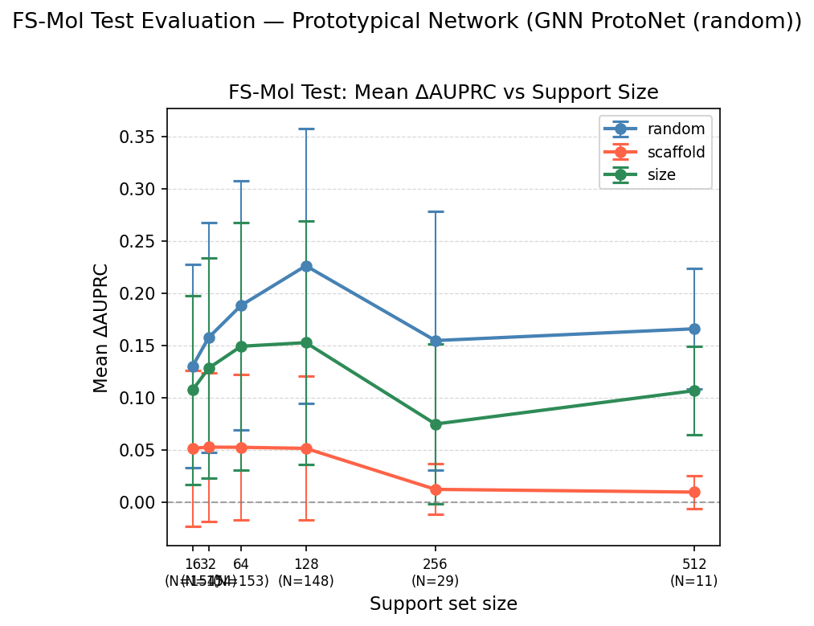
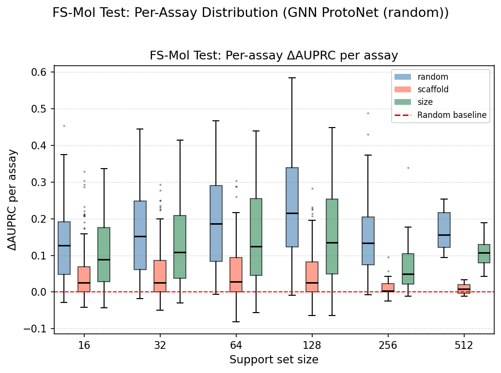
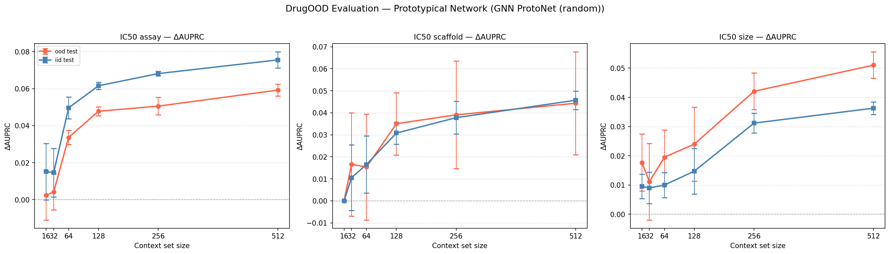
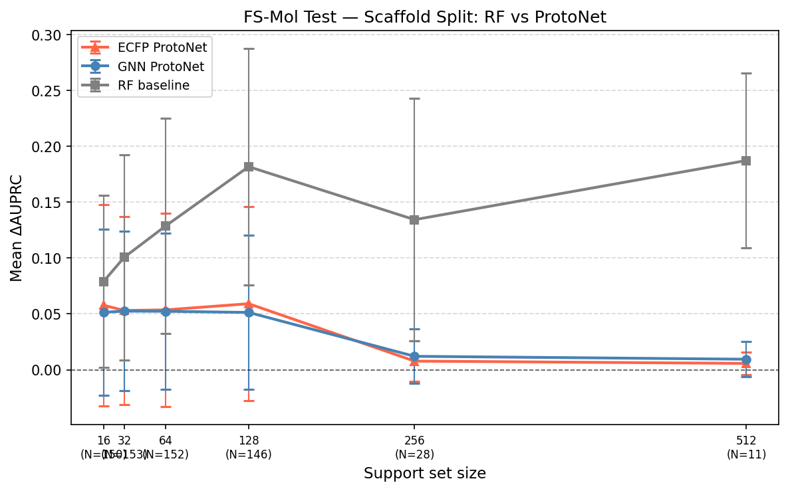
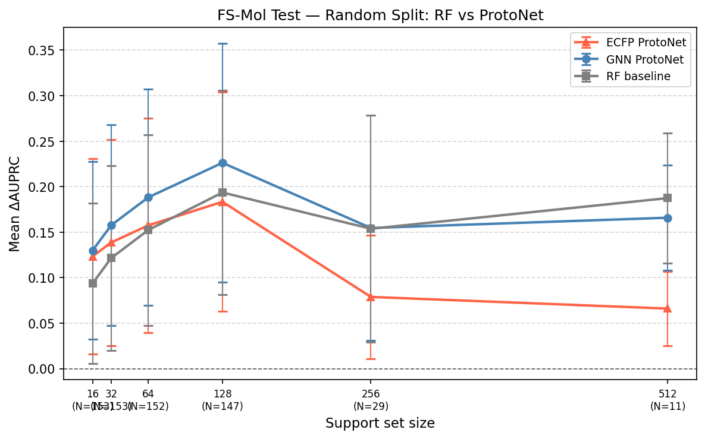
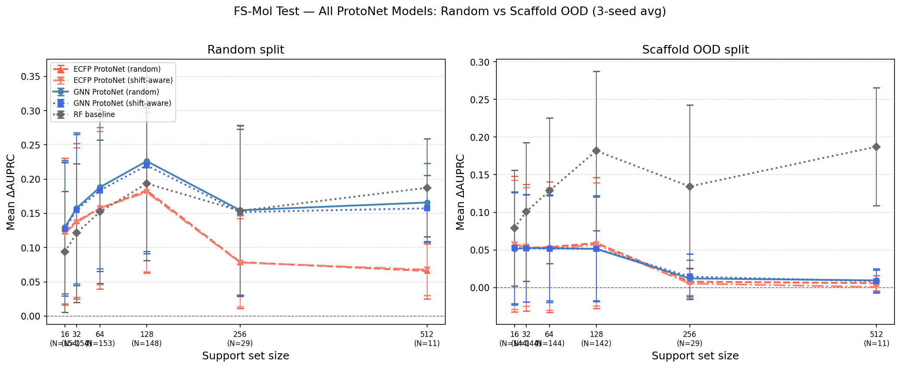
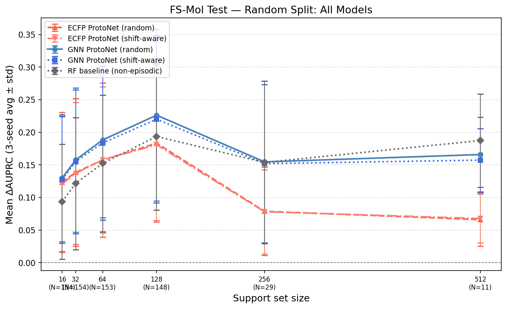
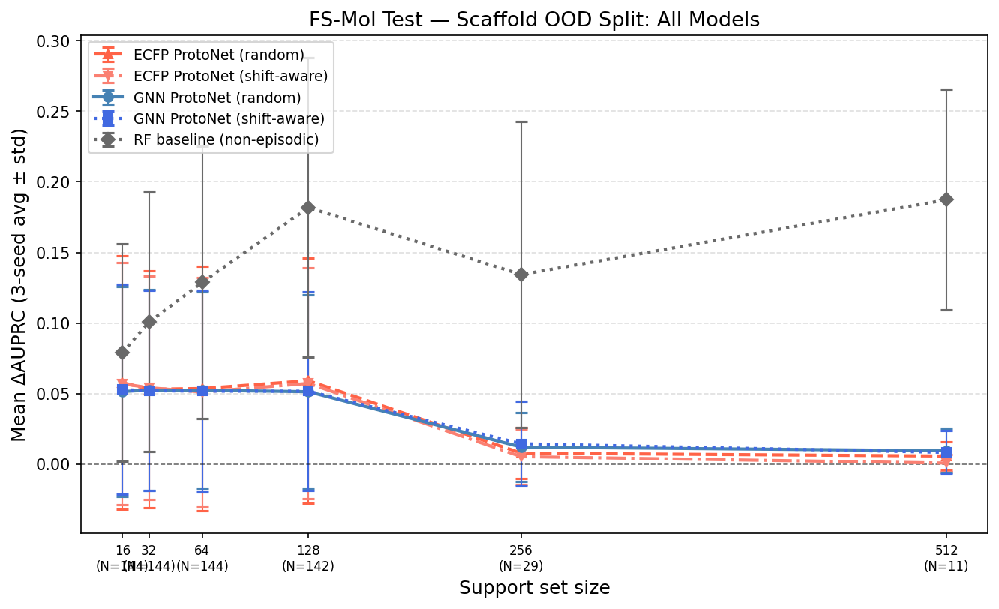
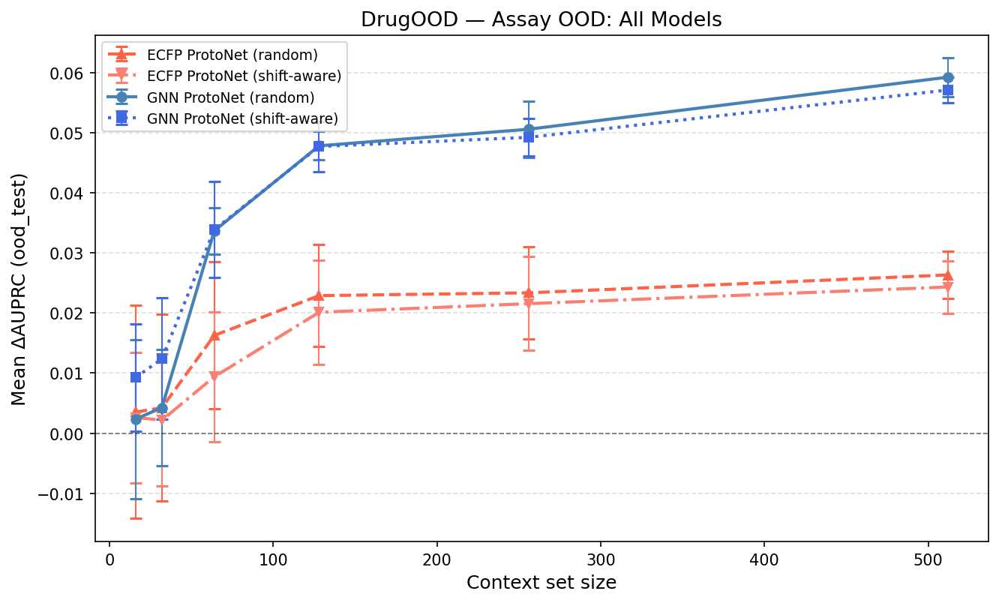

# Model Analysis

Scripts for evaluating trained models and generating result figures. All scripts read paths from `config.py` and write outputs to `FIGURES_DIR` / `RESULTS_DIR`. Run after `main.py` has produced the evaluation CSVs.

---

## Scripts

### `plot_results.py`

Generates all result figures for a given model run from the CSVs produced by `main.py`.

**Usage:**

```bash
python Analysis/model/plot_results.py --run_tag fsmol_gnn_classification_shift_aware
# or by components:
python Analysis/model/plot_results.py --encoder fsmol_gnn --head classification --split shift_aware
```

**Figures generated:**

| Figure | Description |
|---|---|
| `fig2a_fsmol_line_plot_{run_tag}.png` | ΔAUPRC vs support size, one line per split type (random / scaffold / size). Error bars = ±1 std across assays. |
| `fig2b_fsmol_boxplot_{run_tag}.png` | Per-assay ΔAUPRC distribution across support sizes. |
| `fig3_drugood_line_plot_{run_tag}.png` | ΔAUPRC vs context size for each DrugOOD shift type, OOD and IID as separate lines. |

---

### `plot_multi_seed.py`

Merges seed0/1/2 result CSVs, generates per-model and all-model comparison figures. Use this for all classification runs (which have 3 seeds each). For the single-seed regression run, use `plot_results.py` instead.

```bash
# regenerate all per-model figures + comparison figures
python Analysis/model/plot_multi_seed.py --all

# single model only
python Analysis/model/plot_multi_seed.py --model fsmol_gnn_classification_random

# comparison figures only (skip per-model re-generation)
python Analysis/model/plot_multi_seed.py --comparison-only
```

**Figures generated (per model):** `fig2a_fsmol_line_plot.png`, `fig2b_fsmol_boxplot.png`, `fig3_drugood_line_plot.png`

**Comparison figures (all models overlaid, saved to `data_analysis/`):** `fig_comparison_random.png`, `fig_comparison_scaffold.png`, `fig_comparison_random_vs_scaffold.png`, `fig_comparison_drugood_assay.png`

---

### `rf_baseline.py`

Trains a fresh `RandomForestClassifier` on each FS-Mol test assay's context set and evaluates on the query. Establishes the ECFP feature upper ceiling independent of meta-learning. Results go to `DATA_ANALYSIS_RESULTS_DIR/rf_baseline_results.csv`.

```bash
python Analysis/model/rf_baseline.py
```

---

### `run_ttpa.py`

Evaluates all 4 classification models with and without TTPA (Test-Time Prototype Adaptation) and prints side-by-side comparison tables. Saves per-seed CSVs and 3-seed aggregate CSVs.

TTPA reweights each support molecule's prototype contribution by its mean binary Tanimoto similarity to the query set - training-free, runs on existing checkpoints.

```bash
# run all 4 models x 3 seeds
python Analysis/model/run_ttpa.py

# single model / seed
python Analysis/model/run_ttpa.py --model fsmol_gnn_classification_random --seed 0
```

**Output files:**
- `outputs/results/{run_tag}/fsmol_test_results_ttpa.csv` - per-seed scaffold+random results for both methods
- `outputs/results/{model}_ttpa_aggregate.csv` - 3-seed mean ± std for standard vs TTPA

**Result (2026-06-28):** TTPA produces no meaningful improvement on scaffold ΔAUPRC (+0.0003 to +0.0005 at n=128, noise level). See [../../README.md](../../README.md) Interventions section.

---

### `diagnostic_baseline.py`

Compares a pretrained PTN against simple baselines (mean-label, kNN k=1/3/5, KR-Tanimoto α=0.01/0.1/1.0) on the same episodes.

```bash
python Analysis/model/diagnostic_baseline.py
```

---

## Completed Runs

Five model runs + RF lower-bound baseline completed.

| Run | Encoder | Head | Episodes | Pool / Streaming |
|---|---|---|---|---|
| 1 | ECFP 2048-bit MLP | Regression | Shift-aware | Pool-based (~62 assays) |
| 2 | ECFP 2048-bit MLP | Classification | Shift-aware | **Streaming (all 26,868 assays)** |
| 3 | ECFP 2048-bit MLP | Classification | **Random** | **Streaming (all 26,868 assays)** |
| 4 | FS-Mol GNN 10L | Classification | Shift-aware | **Streaming (all 26,868 assays)** |
| 5 | FS-Mol GNN 10L | Classification | **Random** | **Streaming (all 26,868 assays)** |
| RF | ECFP (fixed params) | RandomForest | - | Per-task fresh fit (no meta-learning) |
| 6 | FS-Mol GNN 10L | Classification | **Ratio anneal 0%→60%** | **Streaming (all 26,868 assays)** |

**Note on Run 6 (ratio annealing):** Episode scaffold fraction linearly increased from 0.0→0.60 over 100 epochs. Seed 0 done (Val dAUPRC +0.2084 at epoch 98), seeds 1-2 pending. Scaffold ΔAUPRC at n=128: 0.049 - no improvement over baselines. See `pretrain_classification_anneal` in [../../train.py](../../train.py).

**Note on Run 1 (pool-based):** Trained on a fixed pool of ~62 assays. Useful as a legacy ECFP regression baseline but not comparable to streaming runs.

**Note on Run 2 (streaming ECFP shift-aware):** Re-run of the ECFP classification head with streaming training (all 26,868 assays) and shift-aware scaffold episodes. Directly comparable to Run 3 (same encoder + head, different episode type).

**Note on Run 3 (streaming ECFP random):** IID (random) episodes matching the paper's training protocol. Compared with Run 2, reveals that the n=256 performance drop is an ECFP representation limit, not a scaffold-aware training artifact.

**Note on Run 4 (streaming GNN shift-aware):** Primary comparison against the FS-Mol paper. All known implementation differences fixed (binary labels, sum aggregator, 10k steps).

**Note on Run 5 (streaming GNN random):** Same GNN with IID random episodes. Isolates whether the n=256 scaffold-split collapse is due to shift-aware training or is intrinsic to prototype-based inference.

**Note on RF baseline:** `Analysis/model/rf_baseline.py`. Per-task supervised learning - no episode structure, no meta-training, no prototype computation. Establishes the performance ceiling for ECFP features alone on scaffold-split evaluation.

---

## Results

### Run 1: ECFP + Regression Head - Shift-Aware, Pool-Based

> **Encoder:** ECFP4 2048-bit → 3-layer MLP → 256-dim  
> **Training:** Pool-based, ~62-assay pool, lr=1e-3, n_support=16, n_query=16  
> **Best checkpoint:** epoch 15, Val RMSE 0.5270  
> **Evaluation:** 154 FS-Mol test assays

#### FS-Mol Test - ΔAUPRC

| Support size | Random | Scaffold | Size |
|---|---|---|---|
| 16 | 0.0283 | 0.0177 | 0.0305 |
| 32 | 0.0331 | 0.0182 | 0.0325 |
| 64 | 0.0408 | 0.0192 | 0.0298 |
| 128 | 0.0618 | 0.0191 | 0.0340 |
| 256 | 0.0652 | 0.0028 | 0.0340 |
| 512 | 0.0560 | −0.0030 | 0.0379 |

#### FS-Mol Test - Spearman ρ (Random split)

| n=16 | n=32 | n=64 | n=128 | n=256 | n=512 |
|---|---|---|---|---|---|
| 0.067 | 0.085 | 0.107 | 0.114 | 0.171 | 0.107 |

**Inside-task OOD (scaffold split, n_support=16):** Mean ΔAUPRC = 0.041 across 153 assays.

#### DrugOOD - ΔAUPRC (IC50)

| Context size | Scaffold OOD | Scaffold IID | Size OOD | Size IID | Assay OOD | Assay IID |
|---|---|---|---|---|---|---|
| 16 | −0.0182 | −0.0135 | +0.0133 | +0.0045 | +0.0018 | +0.0037 |
| 32 | −0.0100 | −0.0080 | +0.0191 | +0.0059 | +0.0039 | +0.0074 |
| 64 | −0.0105 | −0.0069 | +0.0131 | +0.0029 | +0.0073 | +0.0090 |
| 128 | +0.0226 | +0.0095 | +0.0116 | +0.0063 | +0.0115 | +0.0170 |
| 256 | −0.0006 | −0.0024 | +0.0218 | +0.0095 | +0.0120 | +0.0164 |
| 512 | +0.0175 | +0.0086 | +0.0175 | +0.0087 | +0.0137 | +0.0175 |
| **Mean** | **0.0001** | **−0.0005** | **0.0161** | **0.0063** | **0.0084** | **0.0118** |

**Key observations:**
- Scaffold OOD is largely negative or near-zero - regression kernel with ECFP fails to generalise cross-scaffold.
- Assay OOD modest (0.008), improves monotonically with context size.
- Spearman peaks at n=256 (0.171) then drops at n=512, consistent with the ΔAUPRC pattern.

#### Figures

**Figure 2(a) - ΔAUPRC vs support size:**


**Figure 2(b) - Per-assay ΔAUPRC distribution:**


**Figure 3 - DrugOOD ΔAUPRC vs context size:**


---

### Run 2: ECFP + Classification Head - Shift-Aware, Streaming

> **Encoder:** ECFP4 2048-bit → 3-layer MLP → 256-dim  
> **Training:** Streaming from all 26,868 FS-Mol train assays. lr=1e-3, BCE loss, 16 tasks/step, 10,000 gradient steps. Binary ChEMBL labels. Shift-aware scaffold episodes.  
> **Evaluation:** 154 FS-Mol test assays. **All values are 3-seed (seed0/1/2) averages.**

#### FS-Mol Test - ΔAUPRC (3-seed avg)

| Support size | Random | Scaffold | Size |
|---|---|---|---|
| 16 | 0.1209 | 0.0570 | 0.1036 |
| 32 | 0.1368 | 0.0542 | 0.1199 |
| 64 | 0.1577 | 0.0511 | 0.1302 |
| 128 | **0.1809** | 0.0573 | 0.1284 |
| 256 | 0.0782 | 0.0053 | 0.0307 |
| 512 | 0.0678 | 0.0007 | 0.0425 |

**Inside-task OOD (scaffold split, n_support=16):** Mean ΔAUPRC = 0.021 across 153 assays.

#### DrugOOD - ΔAUPRC (IC50, 3-seed avg)

| Context size | Scaffold OOD | Scaffold IID | Size OOD | Size IID | Assay OOD | Assay IID |
|---|---|---|---|---|---|---|
| 16 | +0.0000 | +0.0000 | +0.0083 | +0.0040 | +0.0026 | +0.0002 |
| 32 | +0.0029 | −0.0006 | −0.0028 | +0.0007 | +0.0022 | +0.0001 |
| 64 | −0.0041 | −0.0039 | −0.0072 | +0.0009 | +0.0094 | +0.0124 |
| 128 | +0.0015 | +0.0013 | −0.0040 | +0.0038 | +0.0201 | +0.0245 |
| 256 | +0.0143 | +0.0103 | +0.0198 | +0.0084 | +0.0215 | +0.0289 |
| 512 | +0.0152 | +0.0099 | +0.0252 | +0.0114 | +0.0243 | +0.0323 |
| **Mean** | **0.0050** | **0.0028** | **0.0066** | **0.0049** | **0.0134** | **0.0164** |

**Key observations:**
- Compared to Run 3 (random episodes), shift-aware training is comparable at n=128 (0.181 vs 0.183) - episode type matters less than encoder for ECFP.
- **n=256 drop** occurs under both episode types (0.181 → 0.078 for shift-aware; 0.183 → 0.079 for random). An ECFP prototype capacity limit, not episode-type-specific.
- **DrugOOD**: shift-aware ECFP (assay OOD 0.013) is lower than random ECFP (0.016) - shift-aware episodes don't improve cross-dataset transfer for the ECFP encoder.

#### Figures

**Figure 2(a) - ΔAUPRC vs support size:**


**Figure 2(b) - Per-assay ΔAUPRC distribution:**


**Figure 3 - DrugOOD ΔAUPRC vs context size:**


---

### Run 3: ECFP + Classification Head - Random, Streaming

> **Encoder:** ECFP4 2048-bit → 3-layer MLP → 256-dim  
> **Training:** Streaming from all 26,868 FS-Mol train assays. lr=1e-3, BCE loss, 16 tasks/step, 10,000 gradient steps. Binary ChEMBL labels. **Random IID episodes** (paper-matching protocol).  
> **Evaluation:** 154 FS-Mol test assays. **All values are 3-seed (seed0/1/2) averages.**

#### FS-Mol Test - ΔAUPRC (3-seed avg)

| Support size | Random | Scaffold | Size |
|---|---|---|---|
| 16 | 0.1234 | 0.0578 | 0.1059 |
| 32 | 0.1386 | 0.0531 | 0.1197 |
| 64 | 0.1575 | 0.0536 | 0.1285 |
| 128 | **0.1834** | 0.0592 | 0.1305 |
| 256 | 0.0788 | 0.0078 | 0.0335 |
| 512 | 0.0660 | 0.0057 | 0.0395 |

**Inside-task OOD (scaffold split, n_support=16):** Mean ΔAUPRC = 0.019 across 153 assays.

#### DrugOOD - ΔAUPRC (IC50, 3-seed avg)

| Context size | Scaffold OOD | Scaffold IID | Size OOD | Size IID | Assay OOD | Assay IID |
|---|---|---|---|---|---|---|
| 16 | +0.0000 | +0.0000 | +0.0165 | +0.0059 | +0.0035 | +0.0043 |
| 32 | +0.0081 | +0.0052 | +0.0105 | +0.0067 | +0.0042 | +0.0067 |
| 64 | +0.0055 | +0.0054 | +0.0102 | +0.0055 | +0.0163 | +0.0192 |
| 128 | +0.0255 | +0.0177 | +0.0157 | +0.0091 | +0.0229 | +0.0292 |
| 256 | +0.0277 | +0.0182 | +0.0240 | +0.0121 | +0.0234 | +0.0294 |
| 512 | +0.0281 | +0.0196 | +0.0282 | +0.0138 | +0.0263 | +0.0333 |
| **Mean** | **0.0158** | **0.0110** | **0.0175** | **0.0089** | **0.0161** | **0.0204** |

**Key observations:**
- **n=256 drop occurs with random IID training** (0.183 → 0.079), confirming this is an ECFP prototype capacity limit, not caused by scaffold-aware episodes.
- **Scaffold split collapse** (0.059 at n=16, → 0.008 at n=256, → 0.006 at n=512) is consistent across all ECFP runs. The collapse is structural, not episode-type-dependent.
- **GNN vs ECFP encoder**: at n=128, GNN random (0.226) vs ECFP random (0.183) - +0.043 from structural features. GNN also avoids the n=256 collapse (0.155 at n=512 vs ECFP 0.066).
- **DrugOOD**: ECFP assay OOD (0.016 mean) is less than half of GNN (0.033) - structural features drive cross-dataset generalization.

#### Figures

**Figure 2(a) - ΔAUPRC vs support size:**


**Figure 2(b) - Per-assay ΔAUPRC distribution:**


**Figure 3 - DrugOOD ΔAUPRC vs context size:**


---

### Run 4: FS-Mol GNN 10-Layer + Classification Head - Shift-Aware, Streaming

> **Encoder:** 10-layer PNA GNN + CombinedReadout + ECFP + descriptor fusion → 512-dim (FS-Mol paper architecture)  
> **Training:** Streaming from all 26,868 FS-Mol train assays. lr=1e-4, BCE loss, 16 tasks/step, 10,000 gradient steps. Binary ChEMBL labels. Sum aggregator. Shift-aware scaffold episodes.  
> **Evaluation:** 154 FS-Mol test assays. **All values are 3-seed (seed0/1/2) averages.**  
> **Note:** Primary comparison against the FS-Mol paper. All known implementation differences fixed.

#### FS-Mol Test - ΔAUPRC (3-seed avg)

| Support size | Random | Scaffold | Size |
|---|---|---|---|
| 16 | **0.1275** | 0.0528 | 0.1033 |
| 32 | 0.1551 | 0.0520 | 0.1225 |
| 64 | 0.1836 | 0.0517 | 0.1423 |
| 128 | **0.2201** | 0.0517 | 0.1444 |
| 256 | 0.1519 | 0.0145 | 0.0711 |
| 512 | 0.1574 | 0.0083 | 0.1067 |

**Inside-task OOD (scaffold split, n_support=16):** Mean ΔAUPRC = 0.021 across 153 assays.

#### DrugOOD - ΔAUPRC (IC50, 3-seed avg)

| Context size | Scaffold OOD | Scaffold IID | Size OOD | Size IID | Assay OOD | Assay IID |
|---|---|---|---|---|---|---|
| 16 | +0.0000 | +0.0000 | +0.0236 | +0.0077 | +0.0093 | +0.0243 |
| 32 | +0.0205 | +0.0101 | +0.0090 | +0.0073 | +0.0124 | +0.0260 |
| 64 | +0.0215 | +0.0168 | +0.0100 | +0.0044 | +0.0339 | +0.0528 |
| 128 | +0.0398 | +0.0301 | +0.0163 | +0.0115 | +0.0477 | +0.0619 |
| 256 | +0.0436 | +0.0380 | +0.0353 | +0.0296 | +0.0492 | +0.0672 |
| 512 | +0.0461 | +0.0441 | +0.0450 | +0.0355 | +0.0571 | +0.0740 |
| **Mean** | **0.0286** | **0.0232** | **0.0232** | **0.0160** | **0.0349** | **0.0510** |

**Key observations:**
- **At n=16, matches FS-Mol paper** (0.128 vs paper 0.126). **At n=128, exceeds paper** (0.220 vs 0.201). The label binarisation fix was the dominant factor.
- **Scaffold split flat then collapses** (0.053 at n=128 → 0.008 at n=512) - identical pattern to GNN random (Run 5), confirming the collapse is intrinsic to prototype-based inference under scaffold OOD, not a training-episode artefact.
- **Shift-aware vs random training**: scaffold-split ΔAUPRC is essentially identical between Run 4 and Run 5 at n≤128. The episode type does not resolve the scaffold OOD failure.
- DrugOOD assay OOD (0.035 mean) is the strongest cross-dataset transfer signal among all runs.

#### Figures

**Figure 2(a) - ΔAUPRC vs support size (3-seed avg):**


**Figure 2(b) - Per-assay ΔAUPRC distribution:**


**Figure 3 - DrugOOD ΔAUPRC vs context size:**


---

### Run 5: FS-Mol GNN 10-Layer + Classification Head - Random, Streaming

> **Encoder:** 10-layer PNA GNN + CombinedReadout + ECFP + descriptor fusion → 512-dim (FS-Mol paper architecture)  
> **Training:** Streaming from all 26,868 FS-Mol train assays. lr=1e-4, BCE loss, 16 tasks/step, 10,000 gradient steps. Binary ChEMBL labels. **Random IID episodes** (paper-matching protocol).  
> **Evaluation:** 154 FS-Mol test assays. **All values are 3-seed (seed0/1/2) averages.**  
> **Note:** Paired with Run 4 to isolate the effect of episode type on scaffold OOD. Paired with Run 3 (ECFP random) to isolate the effect of encoder.

#### FS-Mol Test - ΔAUPRC (3-seed avg)

| Support size | Random | Scaffold | Size |
|---|---|---|---|
| 16 | **0.1299** | 0.0514 | 0.1071 |
| 32 | 0.1576 | 0.0525 | 0.1282 |
| 64 | 0.1883 | 0.0524 | 0.1491 |
| 128 | **0.2262** | 0.0513 | 0.1526 |
| 256 | 0.1546 | 0.0121 | 0.0747 |
| 512 | 0.1659 | 0.0094 | 0.1067 |

**Inside-task OOD (scaffold split, n_support=16):** Mean ΔAUPRC = 0.020 across 153 assays.

#### DrugOOD - ΔAUPRC (IC50, 3-seed avg)

| Context size | Scaffold OOD | Scaffold IID | Size OOD | Size IID | Assay OOD | Assay IID |
|---|---|---|---|---|---|---|
| 16 | +0.0000 | +0.0000 | +0.0177 | +0.0095 | +0.0024 | +0.0152 |
| 32 | +0.0166 | +0.0105 | +0.0111 | +0.0090 | +0.0043 | +0.0146 |
| 64 | +0.0154 | +0.0165 | +0.0195 | +0.0100 | +0.0337 | +0.0496 |
| 128 | +0.0350 | +0.0308 | +0.0240 | +0.0147 | +0.0478 | +0.0616 |
| 256 | +0.0391 | +0.0378 | +0.0421 | +0.0312 | +0.0506 | +0.0681 |
| 512 | +0.0443 | +0.0457 | +0.0510 | +0.0363 | +0.0592 | +0.0755 |
| **Mean** | **0.0251** | **0.0236** | **0.0276** | **0.0185** | **0.0330** | **0.0474** |

**Key observations:**
- **Random split slightly stronger than shift-aware** at n=128 (0.226 vs 0.220) and n=256 (0.155 vs 0.152) - IID training gives marginally better IID evaluation, as expected.
- **Scaffold split is identical to Run 4** (0.051 at n=16, 0.009–0.012 at n=256/512). Episode type does not help with scaffold OOD. This is the key negative result - shift-aware training does NOT fix scaffold-split collapse.
- **GNN vs ECFP on random split**: GNN random (0.226 at n=128) vs ECFP random (0.187 at n=128) - GNN encoder adds +0.039 ΔAUPRC at peak and avoids the large-n collapse (0.166 at n=512 vs ECFP 0.074). The structural encoder matters for scaling.
- **DrugOOD**: assay OOD (0.033 mean) slightly lower than shift-aware GNN (0.035). Shift-aware episodes provide marginal benefit for cross-dataset transfer.

#### Figures

**Figure 2(a) - ΔAUPRC vs support size (3-seed avg):**


**Figure 2(b) - Per-assay ΔAUPRC distribution:**


**Figure 3 - DrugOOD ΔAUPRC vs context size:**


---

### Baseline Diagnostic - ECFP Regression vs kNN / KR-Tanimoto

Two modes. **Train mode** is a sanity check on train assays. **Test mode** uses all 154 held-out test assays.

#### Train Mode - Sanity Check

> 100 sampled train assays × 10 episodes × 2 split types (random / scaffold). Fixed query size N=16.

| Method | Random MSE | Scaffold MSE |
|---|---|---|
| Mean-label | 0.6304 | 1.0092 |
| kNN (k=1) | 0.7399 | 1.2151 |
| kNN (k=3) | 0.5612 | 1.1262 |
| kNN (k=5) | 0.5501 | 1.0918 |
| KR-Tanimoto (α=0.01) | 0.9180 | 6.226 |
| KR-Tanimoto (α=0.10) | 0.9493 | 6.431 |
| KR-Tanimoto (α=1.00) | 1.7145 | 7.856 |
| **PTN (ECFP regression)** | **0.5486** | **1.0204** |

PTN marginally best on random; KR-Tanimoto catastrophically overfits on scaffold split (MSE 6–8 vs mean-label 1.0).

#### Test Mode - All 154 FS-Mol Test Assays

**ΔAUPRC - Random split:**

| Support size | kNN (k=5) | KR-Tanimoto (α=0.01) | PTN (ECFP reg) |
|---|---|---|---|
| 16 | +0.0434 | +0.0602 | +0.0296 |
| 32 | +0.0515 | +0.0708 | +0.0375 |
| 64 | +0.0620 | +0.0780 | +0.0368 |
| 128 | +0.0842 | +0.1064 | +0.0681 |
| 256 | +0.1408 | +0.1600 | +0.0558 |
| 512 | +0.1410 | +0.1650 | +0.0599 |

**Key findings:**
- kNN and KR-Tanimoto outperform PTN (ECFP regression) on random split - raw ECFP retrieval beats the learned embedding for this head.
- PTN does not outperform raw ECFP baselines for the regression head - the classification head and GNN encoder are both improvements.
- On scaffold split, all ECFP-based methods cluster together - the representation limits cross-scaffold transfer regardless of prediction method.

---

### RF Baseline (`rf_baseline.py`)

> **Method:** `RandomForestClassifier` trained fresh on each context set. No episode structure or meta-training. Fixed params: n_estimators=100, max_depth=10, max_features="sqrt", min_samples_leaf=2.  
> **Purpose:** Lower bound / ceiling for ECFP features under scaffold OOD. If RF > ProtoNet, the bottleneck is embedding similarity geometry, not feature expressivity.

#### FS-Mol Test - Mean ΔAUPRC (5 repeats per assay)

**Scaffold split:**

| Support size | RF baseline | GNN ProtoNet | ECFP ProtoNet | N assays (RF) |
|---|---|---|---|---|
| 16 | 0.079 | 0.051 | 0.058 | 150 |
| 32 | 0.101 | 0.053 | 0.053 | 153 |
| 64 | 0.129 | 0.052 | 0.054 | 152 |
| 128 | **0.182** | 0.051 | 0.059 | 146 |
| 256 | 0.134 | 0.012 | 0.008 | 28 |
| 512 | 0.187 | 0.009 | 0.006 | 11 |

**Random split:**

| Support size | RF baseline | N assays |
|---|---|---|
| 16 | 0.094 | 153 |
| 32 | 0.122 | 153 |
| 64 | 0.152 | 152 |
| 128 | 0.194 | 147 |
| 256 | 0.154 | 29 |
| 512 | 0.187 | 11 |

> N assays drops at n=256/512 because only large assays can provide that many support molecules - small-N means these estimates have high variance.

**Key findings:**
- **RF scaffold n=128 (0.182) beats all ProtoNet variants (0.051–0.059)**. At n=128, a fresh per-task RF without any meta-learning is 3× better than ProtoNet on scaffold OOD.
- **ProtoNet scaffold split collapses at n=256 (0.008–0.012)**; RF stays at 0.134–0.187. The collapse is specific to prototype-based inference, not a data or feature limitation.
- **At n=16 RF is competitive but slightly weaker** (0.079 vs 0.051–0.058) - with only 16 training samples RF is underpowered; ProtoNet benefits from the globally meta-learned embedding at low n.
- **Conclusion:** The bottleneck under scaffold OOD is not ECFP feature expressivity but the prototype distance mechanism. As support size grows, the prototype increasingly reflects context-scaffold chemistry rather than generalizable activity signal, causing systematic drift from the query distribution.

#### Figures

**Scaffold split - RF vs ProtoNet:**


**Random split - RF vs ProtoNet:**


---

## Comparison Figures - All Models

Generated by `Analysis/model/plot_multi_seed.py --all`. All ProtoNet results are 3-seed averages. RF baseline is included when `rf_baseline_results.csv` is present.

### Random Split vs Scaffold Split (Thesis Main Figure)

Side-by-side: the same models on IID vs scaffold OOD evaluation. Quantifies the split-type gap.



### Random Split - All Models



### Scaffold OOD Split - All Models



### DrugOOD Assay OOD - All Models


