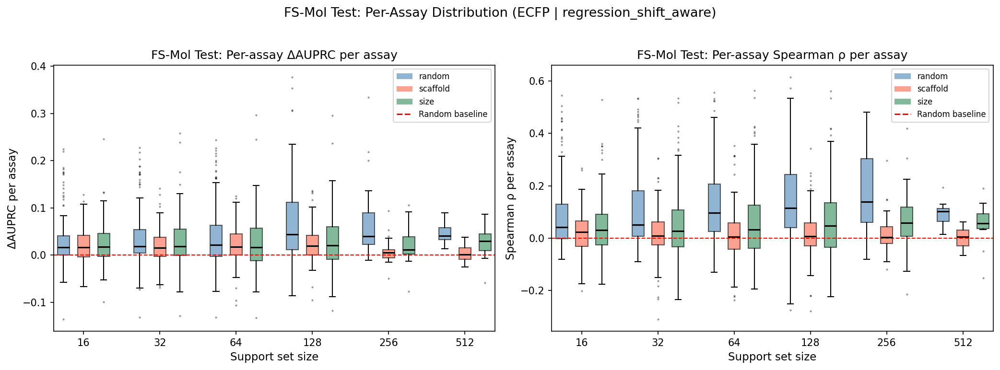
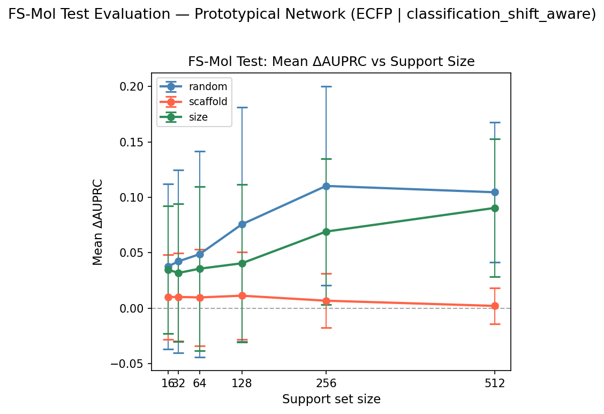
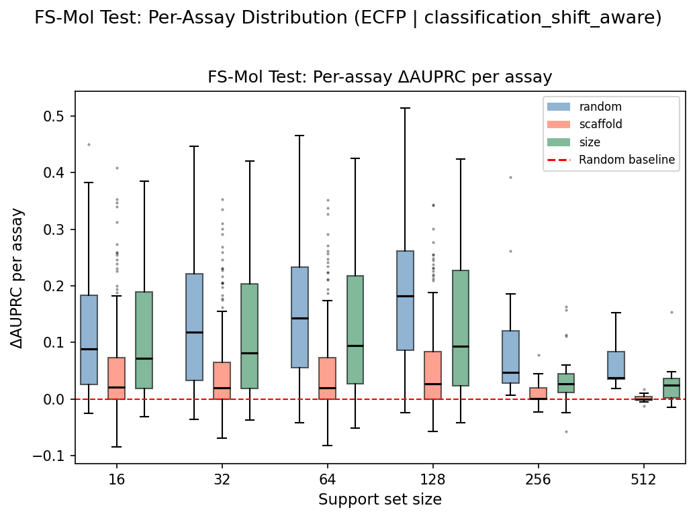
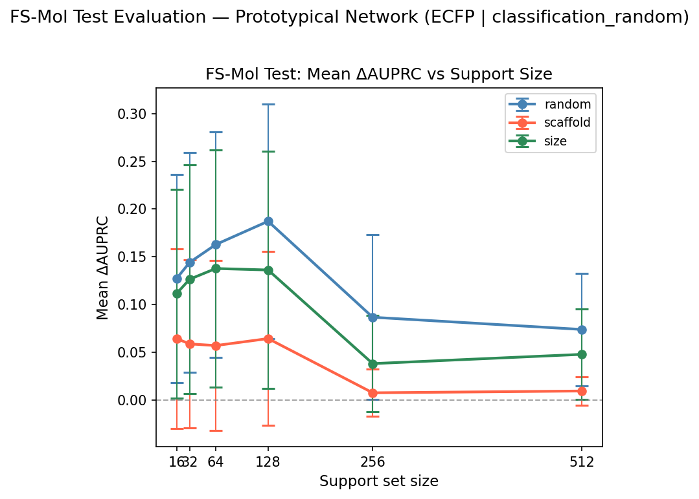
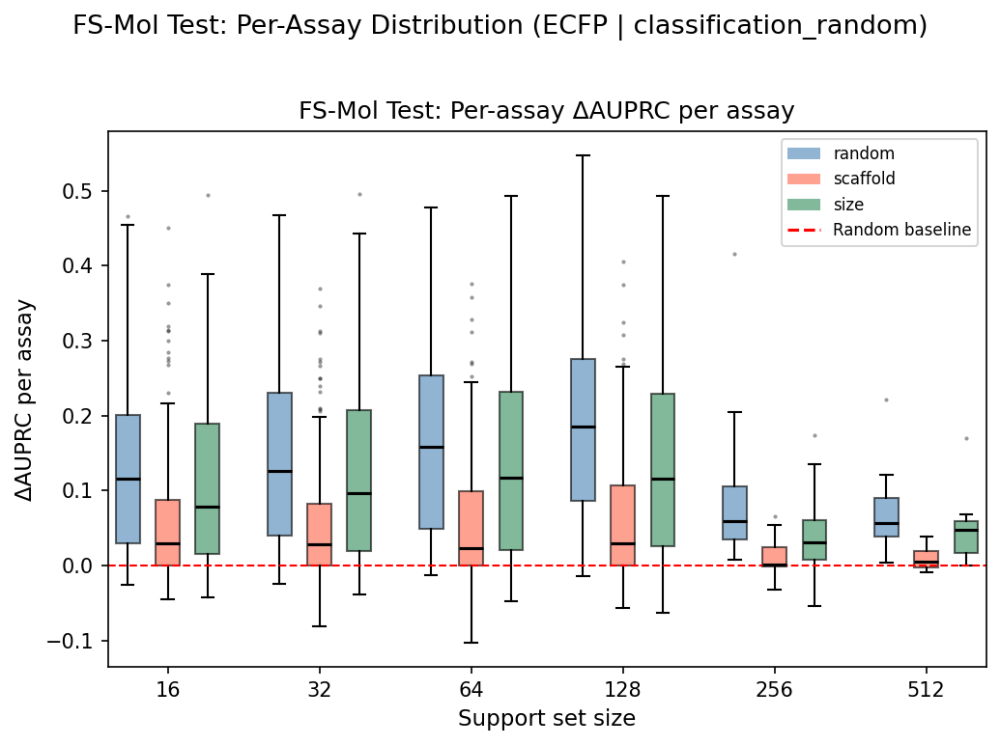
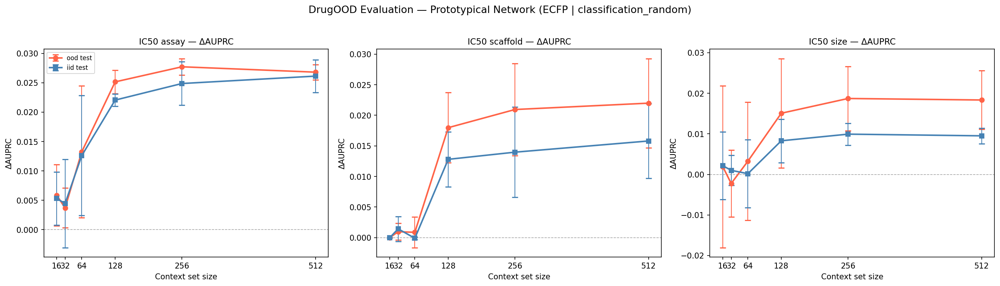
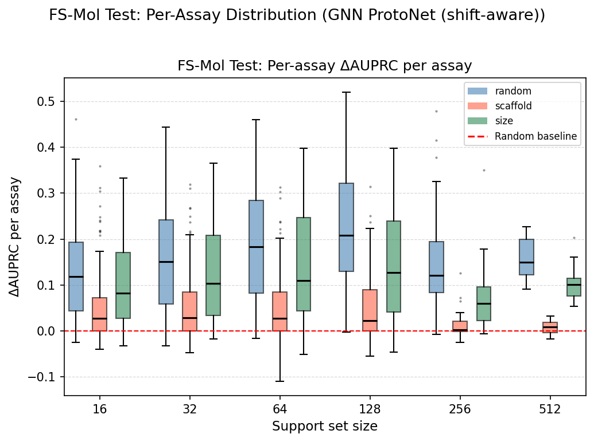

# Model Analysis

Scripts for evaluating trained models and generating result figures. All scripts read paths from `config.py` and write outputs to `FIGURES_DIR` / `RESULTS_DIR`. Run after `main.py` has produced the evaluation CSVs.

---

## Scripts

### `plot_results.py`

Generates all result figures for a given model run from the CSVs produced by `main.py`.

**Usage:**

```bash
python Analysis/model/plot_results.py --run_tag fsmol_gnn_classification_shift_aware
# or by components:
python Analysis/model/plot_results.py --encoder fsmol_gnn --head classification --split shift_aware
```

**Figures generated:**

| Figure | Description |
|---|---|
| `fig2a_fsmol_line_plot_{run_tag}.png` | ΔAUPRC vs support size, one line per split type (random / scaffold / size). Error bars = ±1 std across assays. |
| `fig2b_fsmol_boxplot_{run_tag}.png` | Per-assay ΔAUPRC distribution across support sizes. |
| `fig3_drugood_line_plot_{run_tag}.png` | ΔAUPRC vs context size for each DrugOOD shift type, OOD and IID as separate lines. |

---

### `diagnostic_baseline.py`

Compares a pretrained PTN against simple baselines (mean-label, kNN k=1/3/5, KR-Tanimoto α=0.01/0.1/1.0) on the same episodes.

```bash
python Analysis/model/diagnostic_baseline.py
```

---

## Completed Runs

Four runs completed. A fifth (`fsmol_gnn_classification_random`) is pending.

| Run | Encoder | Head | Episodes | Pool / Streaming |
|---|---|---|---|---|
| 1 | ECFP 2048-bit MLP | Regression | Shift-aware | Pool-based (~62 assays) |
| 2 | ECFP 2048-bit MLP | Classification | Shift-aware | Pool-based (~62 assays) |
| 3 | ECFP 2048-bit MLP | Classification | **Random** | **Streaming (all 26,868 assays)** |
| 4 | FS-Mol GNN 10L | Classification | Shift-aware | **Streaming (all 26,868 assays)** |

**Note on Runs 1–2 (pool-based):** Trained on a fixed pool of ~62 assays. Useful as legacy ECFP baselines but not comparable to streaming runs.

**Note on Run 3 (streaming ECFP random):** First streaming ECFP run. IID (random) episodes matching the paper's training protocol but with an ECFP encoder. Reveals that the n=256 performance drop is an ECFP representation limit, not solely a scaffold-aware training artifact.

**Note on Run 4 (streaming GNN shift-aware):** Primary comparison against the FS-Mol paper. All known implementation differences fixed (binary labels, sum aggregator, 10k steps).

---

## Results

### Run 1: ECFP + Regression Head — Shift-Aware, Pool-Based

> **Encoder:** ECFP4 2048-bit → 3-layer MLP → 256-dim  
> **Training:** Pool-based, ~62-assay pool, lr=1e-3, n_support=16, n_query=16  
> **Best checkpoint:** epoch 15, Val RMSE 0.5270  
> **Evaluation:** 154 FS-Mol test assays

#### FS-Mol Test — ΔAUPRC

| Support size | Random | Scaffold | Size |
|---|---|---|---|
| 16 | 0.0283 | 0.0177 | 0.0305 |
| 32 | 0.0331 | 0.0182 | 0.0325 |
| 64 | 0.0408 | 0.0192 | 0.0298 |
| 128 | 0.0618 | 0.0191 | 0.0340 |
| 256 | 0.0652 | 0.0028 | 0.0340 |
| 512 | 0.0560 | −0.0030 | 0.0379 |

#### FS-Mol Test — Spearman ρ (Random split)

| n=16 | n=32 | n=64 | n=128 | n=256 | n=512 |
|---|---|---|---|---|---|
| 0.067 | 0.085 | 0.107 | 0.114 | 0.171 | 0.107 |

**Inside-task OOD (scaffold split, n_support=16):** Mean ΔAUPRC = 0.041 across 153 assays.

#### DrugOOD — ΔAUPRC (IC50)

| Context size | Scaffold OOD | Scaffold IID | Size OOD | Size IID | Assay OOD | Assay IID |
|---|---|---|---|---|---|---|
| 16 | −0.0182 | −0.0135 | +0.0133 | +0.0045 | +0.0018 | +0.0037 |
| 32 | −0.0100 | −0.0080 | +0.0191 | +0.0059 | +0.0039 | +0.0074 |
| 64 | −0.0105 | −0.0069 | +0.0131 | +0.0029 | +0.0073 | +0.0090 |
| 128 | +0.0226 | +0.0095 | +0.0116 | +0.0063 | +0.0115 | +0.0170 |
| 256 | −0.0006 | −0.0024 | +0.0218 | +0.0095 | +0.0120 | +0.0164 |
| 512 | +0.0175 | +0.0086 | +0.0175 | +0.0087 | +0.0137 | +0.0175 |
| **Mean** | **0.0001** | **−0.0005** | **0.0161** | **0.0063** | **0.0084** | **0.0118** |

**Key observations:**
- Scaffold OOD is largely negative or near-zero — regression kernel with ECFP fails to generalise cross-scaffold.
- Assay OOD modest (0.008), improves monotonically with context size.
- Spearman peaks at n=256 (0.171) then drops at n=512, consistent with the ΔAUPRC pattern.

#### Figures

**Figure 2(a) — ΔAUPRC vs support size:**


**Figure 2(b) — Per-assay ΔAUPRC distribution:**


**Figure 3 — DrugOOD ΔAUPRC vs context size:**


---

### Run 2: ECFP + Classification Head — Shift-Aware, Pool-Based

> **Encoder:** ECFP4 2048-bit → 3-layer MLP → 256-dim  
> **Training:** Pool-based, ~62-assay pool, lr=1e-3, BCE loss, n_support=64, n_query=256  
> **Best checkpoint:** epoch 19, Val ΔAUPRC +0.1616  
> **Evaluation:** 154 FS-Mol test assays. Spearman/RMSE suppressed (predictions are probabilities).

#### FS-Mol Test — ΔAUPRC

| Support size | Random | Scaffold | Size |
|---|---|---|---|
| 16 | 0.0376 | 0.0100 | 0.0347 |
| 32 | 0.0422 | 0.0105 | 0.0318 |
| 64 | 0.0487 | 0.0094 | 0.0356 |
| 128 | 0.0756 | 0.0109 | 0.0404 |
| 256 | 0.1102 | 0.0066 | 0.0690 |
| 512 | 0.1045 | 0.0026 | 0.0904 |

#### DrugOOD — ΔAUPRC (IC50)

| Context size | Scaffold OOD | Scaffold IID | Size OOD | Size IID | Assay OOD | Assay IID |
|---|---|---|---|---|---|---|
| 16 | +0.0085 | +0.0076 | +0.0131 | +0.0101 | +0.0264 | +0.0348 |
| 32 | +0.0201 | +0.0067 | +0.0033 | +0.0042 | +0.0214 | +0.0293 |
| 64 | +0.0199 | +0.0172 | +0.0277 | +0.0159 | +0.0120 | +0.0250 |
| 128 | +0.0181 | +0.0176 | +0.0203 | +0.0133 | +0.0180 | +0.0361 |
| 256 | +0.0215 | +0.0187 | +0.0334 | +0.0175 | +0.0203 | +0.0397 |
| 512 | +0.0248 | +0.0247 | +0.0273 | +0.0141 | +0.0259 | +0.0466 |
| **Mean** | **0.0188** | **0.0154** | **0.0209** | **0.0125** | **0.0207** | **0.0353** |

**Key observations:**
- Classification head substantially outperforms regression on random ΔAUPRC at large n (0.110 vs 0.065 at n=256).
- DrugOOD balanced across all 3 shift types (0.019–0.021 mean OOD).
- Assay IID notably high (0.035 mean) — generalises within-assay better than cross-assay.
- Scaffold split remains weak (0.003–0.021) — representation bottleneck regardless of head type.

#### Figures

**Figure 2(a) — ΔAUPRC vs support size:**


**Figure 2(b) — Per-assay ΔAUPRC distribution:**


**Figure 3 — DrugOOD ΔAUPRC vs context size:**


---

### Run 3: ECFP + Classification Head — Random, Streaming

> **Encoder:** ECFP4 2048-bit → 3-layer MLP → 256-dim  
> **Training:** Streaming from all 26,868 FS-Mol train assays. lr=1e-3, BCE loss, 16 tasks/step, 10,000 gradient steps. Binary ChEMBL labels. **Random IID episodes** (paper-matching protocol).  
> **Best checkpoint:** epoch 77, Val ΔAUPRC +0.1864  
> **Evaluation:** 154 FS-Mol test assays

#### FS-Mol Test — ΔAUPRC

| Support size | Random | Scaffold | Size |
|---|---|---|---|
| 16 | 0.1271 | 0.0642 | 0.1114 |
| 32 | 0.1441 | 0.0586 | 0.1264 |
| 64 | 0.1628 | 0.0569 | 0.1377 |
| 128 | **0.1872** | 0.0642 | 0.1361 |
| 256 | 0.0866 | 0.0073 | 0.0380 |
| 512 | 0.0738 | 0.0092 | 0.0477 |

**Inside-task OOD (scaffold split, n_support=16):** Mean ΔAUPRC = 0.014 across 153 assays.

#### DrugOOD — ΔAUPRC (IC50)

| Context size | Scaffold OOD | Scaffold IID | Size OOD | Size IID | Assay OOD | Assay IID |
|---|---|---|---|---|---|---|
| 16 | +0.0000 | +0.0000 | +0.0019 | +0.0021 | +0.0059 | +0.0053 |
| 32 | +0.0010 | +0.0014 | −0.0022 | +0.0010 | +0.0037 | +0.0044 |
| 64 | +0.0009 | −0.0001 | +0.0033 | +0.0002 | +0.0133 | +0.0126 |
| 128 | +0.0180 | +0.0128 | +0.0151 | +0.0083 | +0.0252 | +0.0221 |
| 256 | +0.0209 | +0.0140 | +0.0187 | +0.0099 | +0.0277 | +0.0249 |
| 512 | +0.0220 | +0.0158 | +0.0183 | +0.0095 | +0.0268 | +0.0261 |
| **Mean** | **0.0105** | **0.0073** | **0.0092** | **0.0052** | **0.0171** | **0.0159** |

**Key observations:**
- Streaming training dramatically improves over pool-based ECFP: n=16 jumps from 0.038 (Run 2) to 0.127, confirming training diversity is the dominant factor for ECFP.
- **n=256 drop occurs even with random IID training** (0.187 → 0.087), refuting the hypothesis that scaffold-aware episodes alone cause the large-n degradation for ECFP. The drop appears to be an ECFP prototype capacity limit — fingerprint-based prototypes saturate or over-fit the support set at large n. The GNN random run will test whether this is encoder-specific.
- Scaffold split collapse at n=256 (0.064 → 0.007) mirrors the GNN shift-aware run — consistent across training regimes.
- DrugOOD is weaker than GNN (assay OOD 0.017 vs 0.036) despite similar FS-Mol random-split performance — cross-assay transfer benefits from GNN's structural features.

#### Figures

**Figure 2(a) — ΔAUPRC vs support size:**


**Figure 2(b) — Per-assay ΔAUPRC distribution:**


**Figure 3 — DrugOOD ΔAUPRC vs context size:**


---

### Run 4: FS-Mol GNN 10-Layer + Classification Head — Shift-Aware, Streaming

> **Encoder:** 10-layer PNA GNN + CombinedReadout + ECFP + descriptor fusion → 512-dim (FS-Mol paper architecture)  
> **Training:** Streaming from all 26,868 FS-Mol train assays. lr=1e-4, BCE loss, 16 tasks/step, 10,000 gradient steps. Binary ChEMBL labels. Sum aggregator.  
> **Best checkpoint:** epoch 69, Val ΔAUPRC +0.2072  
> **Evaluation:** 154 FS-Mol test assays  
> **Note:** Primary comparison against the FS-Mol paper. All known implementation differences fixed.

#### FS-Mol Test — ΔAUPRC

| Support size | Random | Scaffold | Size |
|---|---|---|---|
| 16 | **0.1286** | 0.0501 | 0.1026 |
| 32 | 0.1558 | 0.0532 | 0.1236 |
| 64 | 0.1830 | 0.0515 | 0.1418 |
| 128 | **0.2221** | 0.0530 | 0.1441 |
| 256 | 0.1507 | 0.0108 | 0.0652 |
| 512 | 0.1527 | 0.0062 | 0.0979 |

**Inside-task OOD (scaffold split, n_support=16):** Mean ΔAUPRC = 0.017 across 153 assays.

#### DrugOOD — ΔAUPRC (IC50)

| Context size | Scaffold OOD | Scaffold IID | Size OOD | Size IID | Assay OOD | Assay IID |
|---|---|---|---|---|---|---|
| 16 | +0.0000 | +0.0000 | +0.0219 | +0.0042 | +0.0130 | +0.0235 |
| 32 | +0.0137 | +0.0099 | +0.0098 | +0.0051 | +0.0096 | +0.0205 |
| 64 | +0.0076 | +0.0165 | +0.0017 | +0.0031 | +0.0296 | +0.0474 |
| 128 | +0.0356 | +0.0316 | +0.0146 | +0.0116 | +0.0509 | +0.0630 |
| 256 | +0.0482 | +0.0413 | +0.0456 | +0.0318 | +0.0534 | +0.0680 |
| 512 | +0.0531 | +0.0463 | +0.0536 | +0.0372 | +0.0602 | +0.0747 |
| **Mean** | **0.0264** | **0.0243** | **0.0245** | **0.0155** | **0.0361** | **0.0495** |

**Key observations:**
- **At n=16, matches FS-Mol paper** (0.129 vs paper 0.126). **At n=128, exceeds paper** (0.222 vs 0.201). The label binarisation fix was the dominant factor — the old run achieved only 0.028 at n=16.
- Performance peaks at n=128 then drops to 0.151 at n=256 (paper continues to 0.226). Run 3 (ECFP random) shows the n=256 drop also occurs with IID training for ECFP, so the GNN random run is needed to isolate whether scaffold-aware episodes cause the GNN's n=256 drop specifically.
- **Scaffold split collapse at large n** (0.050 → 0.006 from n=16 to n=512) is the core thesis finding — scaffold OOD uniquely breaks prototypical networks as support size grows, and this holds across all runs regardless of episode type.
- Size split shows intermediate behaviour, peaking at n=128 (0.144) then declining — partially affected by the same scaffold-specialisation effect.
- DrugOOD assay OOD is best among all runs (0.036 mean) — full training distribution teaches cross-assay transfer.

#### Figures

**Figure 2(a) — ΔAUPRC vs support size:**


**Figure 2(b) — Per-assay ΔAUPRC distribution:**


**Figure 3 — DrugOOD ΔAUPRC vs context size:**


---

### Baseline Diagnostic — ECFP Regression vs kNN / KR-Tanimoto

Two modes. **Train mode** is a sanity check on train assays. **Test mode** uses all 154 held-out test assays.

#### Train Mode — Sanity Check

> 100 sampled train assays × 10 episodes × 2 split types (random / scaffold). Fixed query size N=16.

| Method | Random MSE | Scaffold MSE |
|---|---|---|
| Mean-label | 0.6304 | 1.0092 |
| kNN (k=1) | 0.7399 | 1.2151 |
| kNN (k=3) | 0.5612 | 1.1262 |
| kNN (k=5) | 0.5501 | 1.0918 |
| KR-Tanimoto (α=0.01) | 0.9180 | 6.226 |
| KR-Tanimoto (α=0.10) | 0.9493 | 6.431 |
| KR-Tanimoto (α=1.00) | 1.7145 | 7.856 |
| **PTN (ECFP regression)** | **0.5486** | **1.0204** |

PTN marginally best on random; KR-Tanimoto catastrophically overfits on scaffold split (MSE 6–8 vs mean-label 1.0).

#### Test Mode — All 154 FS-Mol Test Assays

**ΔAUPRC — Random split:**

| Support size | kNN (k=5) | KR-Tanimoto (α=0.01) | PTN (ECFP reg) |
|---|---|---|---|
| 16 | +0.0434 | +0.0602 | +0.0296 |
| 32 | +0.0515 | +0.0708 | +0.0375 |
| 64 | +0.0620 | +0.0780 | +0.0368 |
| 128 | +0.0842 | +0.1064 | +0.0681 |
| 256 | +0.1408 | +0.1600 | +0.0558 |
| 512 | +0.1410 | +0.1650 | +0.0599 |

**Key findings:**
- kNN and KR-Tanimoto outperform PTN (ECFP regression) on random split — raw ECFP retrieval beats the learned embedding for this head.
- PTN does not outperform raw ECFP baselines for the regression head — the classification head and GNN encoder are both improvements.
- On scaffold split, all ECFP-based methods cluster together — the representation limits cross-scaffold transfer regardless of prediction method.
