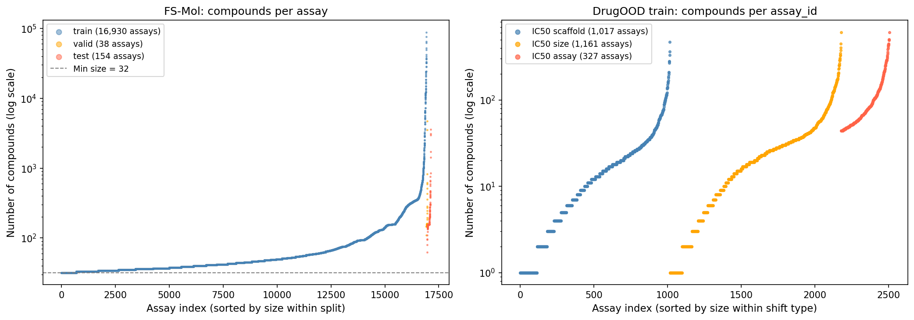
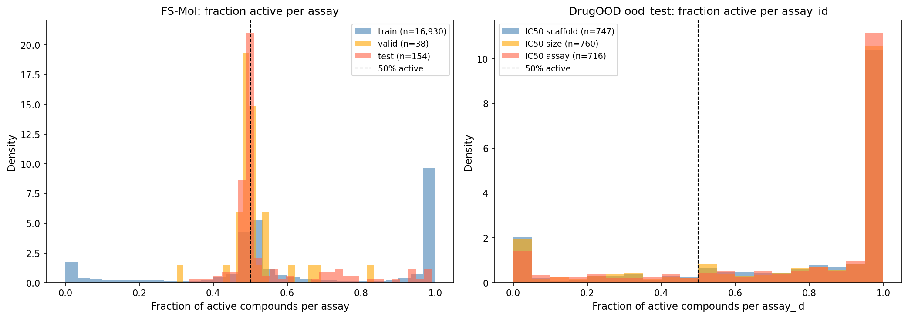
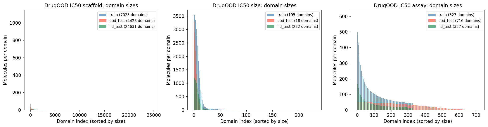
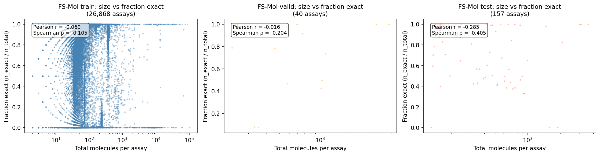
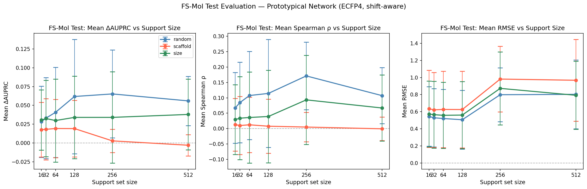
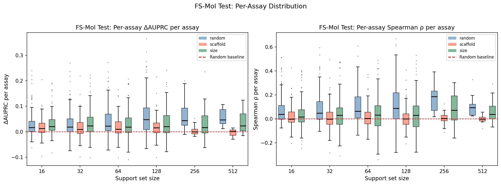
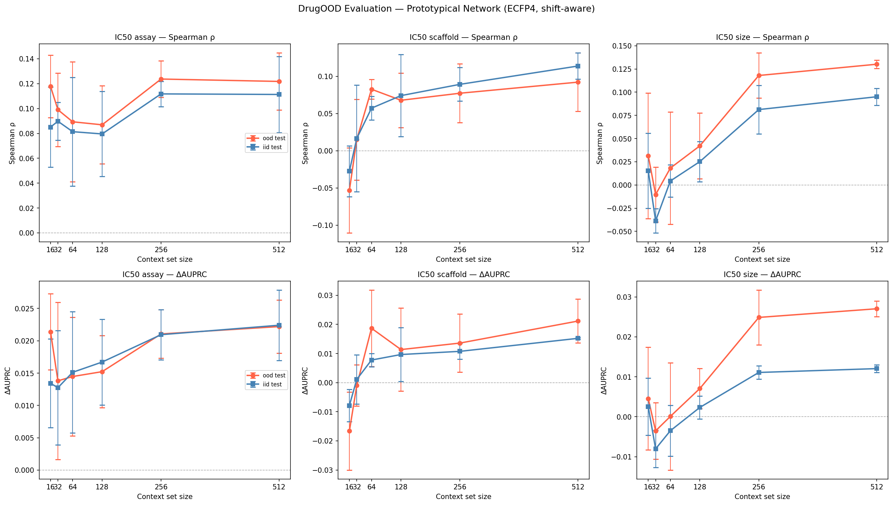
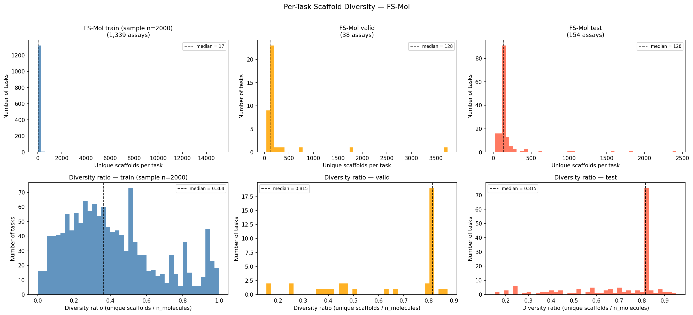

# Prototypical Networks for Molecular OOD Regression

Implementation of Prototypical Networks adapted for regression on molecular property prediction, with out-of-distribution (OOD) generalization evaluation across two benchmarks: FS-Mol and DrugOOD.

- **Pretraining:** FS-Mol (~26k assays from ChEMBL)
- **Evaluation:** DrugOOD benchmark (scaffold, size, and assay shift) + FS-Mol held-out test set
- **Task:** Predict continuous activity values (pIC50) for molecules from unseen chemical distributions

---

## Background

Standard Prototypical Networks (Snell et al., 2017) are designed for few-shot classification. This implementation adapts them for regression via kernel regression in learned embedding space:

$$\hat{y}_q = \sum_{i \in \text{support}} \frac{\exp(-d(f(x_q), f(x_i)))}{\sum_j \exp(-d(f(x_q), f(x_j)))} \cdot y_i$$

The embedding function $f$ is trained episodically on FS-Mol. Episodes are **shift-aware**: support and query molecules come from different scaffold families within the same assay, forcing the embedding to generalise across chemical scaffolds. The pretrained model is then evaluated **zero-shot** on DrugOOD's OOD test splits.

---

## Design Choices

| Component | Chosen | Alternative |
|---|---|---|
| Encoder | ECFP4 (2048-bit) + MLP | GNN (GIN/MPNN), ChemBERTa |
| Distance | Euclidean | Learned MLP metric |
| Temperature | Learnable scalar | Fixed = 1.0 |
| Loss | MSE | MAE, Huber |
| Episodes | Shift-aware (scaffold split) | Random split |
| Evaluation | Zero-shot (frozen encoder) | Fine-tuned |
| Primary metric | ΔAUPRC | RMSE, Spearman ρ |

---

## Repository Structure

```
PTN/
├── config.py                        # Central path config — edit ENV to switch environments
├── main.py                          # Full pipeline entry point
├── model.py                         # Encoder + prototypical regression network
├── data.py                          # Data loading, episode construction
├── train.py                         # Episodic training loop (FS-Mol pretraining)
├── evaluate.py                      # Zero-shot evaluation (DrugOOD + FS-Mol test)
├── requirements.txt
├── .gitignore
│
├── Analysis/
│   ├── data/
│   │   ├── dataset_overview.py      # Dataset stats + data-loss audit
│   │   ├── scaffold_analysis.py     # Per-task scaffold diversity across splits
│   │   ├── structural_variability.py # Molecule-level feature computation (library)
│   │   └── chemical_diversity.py    # FS-Mol vs DrugOOD comparison (Tanimoto, t-SNE)
│   └── model/
│       ├── diagnostic_baseline.py   # PTN vs kNN / KR-Tanimoto diagnostic
│       └── plot_results.py          # Figures from evaluation CSVs
│
├── data/
│   ├── fsmol/
│   │   ├── train/                   # ~26,868 .jsonl.gz assay files
│   │   ├── valid/                   # 40 .jsonl.gz assay files
│   │   └── test/                    # 157 .jsonl.gz assay files
│   └── drugood/
│       ├── lbap_core_ic50_scaffold.json
│       ├── lbap_core_ic50_size.json
│       └── lbap_core_ic50_assay.json
│
├── checkpoints/
│   └── pretrained_model.pt          # Saved after best validation RMSE
│
└── outputs/
    ├── figures/                     # All plots saved here
    └── results/                     # All CSV results saved here
```

---

## File Reference

### `config.py`
Central path configuration. **This is the only file you need to edit when switching environments.**

```python
ENV = "local"   # change to "server" to use server paths
```

| Export | Description |
|---|---|
| `FSMOL_DIR` | Root of FS-Mol dataset |
| `FSMOL_TRAIN / VAL / TEST` | Derived split directories |
| `DRUGOOD_DIR` | Root of DrugOOD JSON files |
| `MODEL_SAVE_PATH` | Path to `pretrained_model.pt` |
| `CHECKPOINT_DIR` | Directory for model checkpoints |
| `FIGURES_DIR` | Output directory for all plots |
| `RESULTS_DIR` | Output directory for all CSVs |

---

### `model.py`
Defines the encoder and the prototypical regression network.

**Classes:**

| Class | Description |
|---|---|
| `MolecularEncoder` | 3-layer MLP: `input_dim → hidden_dim → hidden_dim → embedding_dim`. Input is a 2048-bit ECFP4 fingerprint. Dropout = 0.2. |
| `PrototypicalNetworkRegression` | Wraps `MolecularEncoder`. Predicts query labels via softmax-weighted kernel regression over support embeddings. Temperature is a learned scalar. |

**Key methods on `PrototypicalNetworkRegression`:**

| Method | Description |
|---|---|
| `forward(support_fp, support_labels, query_fp)` | Returns predicted labels for query molecules. |
| `compute_loss_batched(s_fp, s_lbl, q_fp, q_lbl)` | MSE loss + RMSE metric over a batch of episodes. |

**Default hyperparameters:** `hidden_dim=512`, `embedding_dim=256`

---

### `data.py`
Data loading and episode construction for FS-Mol and DrugOOD.

**Classes:**

| Class | Description |
|---|---|
| `AssayDataset` | Holds one FS-Mol assay: fingerprints, labels, scaffold group index. |
| `DrugOODEvalDataset` | Holds one DrugOOD split file: train pool, iid_test, ood_test. |
| `FSMolEpisodeDataset` | PyTorch Dataset that streams episodic batches from disk. Used by the training loop. |
| `EpisodeSampler` | Samples one (support, query) episode from an `AssayDataset`. Supports random and shift-aware (scaffold) strategies. |

**Key functions:**

| Function | Description |
|---|---|
| `mol_to_fingerprint(smiles)` | SMILES → 2048-bit ECFP4 count vector (float32 numpy array). Returns `None` on invalid SMILES. |
| `get_scaffold(smiles)` | Returns generic Bemis-Murcko scaffold SMILES. Used to group molecules into scaffold families. |
| `_load_assay_file(filepath)` | Load one `.jsonl.gz` file into an `AssayDataset`. Only keeps `Relation == "="` (exact measurements). |

**Episode construction (shift-aware):**
Support is sampled from one scaffold group, query from a different group. This forces the embedding to be scaffold-invariant — the central training signal for OOD generalisation.

**Minimum task size:** `MIN_TASK_SIZE = 32` (assays with fewer exact-measurement molecules are skipped).

---

### `train.py`
Episodic training loop for FS-Mol pretraining.

**Functions:**

| Function | Description |
|---|---|
| `train_epoch(model, loader, optimizer, device)` | One epoch: MSE loss over a batch of episodes with gradient clipping (`max_norm=1.0`). Returns `{"loss", "rmse"}`. |
| `validate(model, loader, device)` | Validation RMSE over one epoch. |
| `pretrain(train_files, val_files, ...)` | Full training loop with LR scheduling and early stopping. Saves best checkpoint to `MODEL_SAVE_PATH`. |

**Training details:**
- Optimiser: Adam, `lr=1e-3`
- LR scheduler: ReduceLROnPlateau (`factor=0.5`, `patience=20`)
- Early stopping: patience = 40 epochs (2× LR patience), triggers on validation RMSE
- Checkpoint: saved whenever validation RMSE improves

---

### `evaluate.py`
Zero-shot evaluation on DrugOOD and FS-Mol test set.

**Metrics:**

| Metric | Description |
|---|---|
| ΔAUPRC | `AUPRC(model) − fraction_actives`. Primary metric (FS-Mol paper convention). Positive = better than random. |
| Spearman ρ | Rank correlation between predicted and actual labels. |
| RMSE | Root mean squared error on log-activity labels. |
| MAE | Mean absolute error. |

**Functions:**

| Function | Description |
|---|---|
| `delta_auprc(preds, binary_labels)` | Computes ΔAUPRC. Binary labels are derived from the median activity threshold. |
| `spearman_correlation(preds, targets)` | Spearman ρ, returns `nan` if fewer than 3 predictions. |
| `evaluate_drugood_multiscale(model, drugood_dir, ...)` | Runs evaluation across all 3 DrugOOD shift types × multiple context sizes × iid/ood_test. Saves `drugood_results.csv`. |
| `evaluate_fsmol_test(model, test_files, ...)` | Evaluates on FS-Mol test assays across random/scaffold/size split types and multiple support sizes. Saves `fsmol_test_results.csv`. |
| `evaluate_inside_task_ood(model, test_files, ...)` | Scaffold-split inside-task OOD evaluation on FS-Mol. Saves `inside_task_ood_results.csv`. |
| `load_and_evaluate(checkpoint_path, ...)` | Load model from checkpoint and run full DrugOOD evaluation. |

**Context / support sizes evaluated:**
- DrugOOD: 16, 32, 64, 128, 256, 512
- FS-Mol test: 16, 32, 64, 128, 256, 512

---

### `main.py`
Full pipeline entry point. Runs all four steps in sequence.

```bash
python main.py
```

**Steps:**

| Step | Description |
|---|---|
| 1 | Index FS-Mol files from `FSMOL_TRAIN`, `FSMOL_VAL`, `FSMOL_TEST` |
| 2 | Pretrain Prototypical Network on FS-Mol train assays |
| 3 | Evaluate zero-shot on all DrugOOD IC50 shifts |
| 4a | Evaluate on FS-Mol test set (random / scaffold / size splits) |
| 4b | Inside-task OOD evaluation on FS-Mol test |

**To skip training and load a saved checkpoint** (e.g. to only re-run evaluation), comment out Step 2 in `main.py`. The model is loaded from `MODEL_SAVE_PATH`.

**Outputs written:**
- `outputs/results/fsmol_test_results.csv`
- `outputs/results/drugood_results.csv`
- `outputs/results/inside_task_ood_results.csv`
- `checkpoints/pretrained_model.pt`

---

## Analysis Scripts

All scripts import paths from `config.py` and write outputs to `FIGURES_DIR` / `RESULTS_DIR`.

### `Analysis/data/dataset_overview.py`
Data audit and dataset statistics. Run this before training to understand the data.

**What it does:**
- Scans every FS-Mol assay file and counts total / inexact / invalid / exact molecules
- Reports what fraction of each assay survives the `Relation == "="` filter
- Computes fraction-active per assay (for ΔAUPRC baseline)
- Reports DrugOOD split sizes (train / iid_test / ood_test per shift type)
- Generates Figures 1a, 1b, 1c (assay size distributions, fraction-active distributions, domain sizes)

**Outputs:**
| File | Description |
|---|---|
| `results/assay_sizes_fsmol.csv` | Per-assay molecule counts for all FS-Mol splits |
| `results/data_loss_per_assay.csv` | Per-assay inexact / invalid drop counts |
| `figures/fig1a_assay_sizes.png` | Assay size distributions (train / valid / test) |
| `figures/fig1b_fraction_actives.png` | Fraction-active distribution across assays |
| `figures/fig1c_domain_sizes.png` | DrugOOD domain size distributions |
| `figures/fig_size_vs_fraction_exact.png` | Assay size vs fraction of exact measurements |

```bash
python Analysis/data/dataset_overview.py
```

---

### `Analysis/data/scaffold_analysis.py`
Per-task scaffold diversity across all FS-Mol splits.

**What it does:**
- For each assay passing `MIN_TASK_SIZE=32`, computes number of unique Bemis-Murcko scaffolds and scaffold diversity ratio (`n_unique_scaffolds / n_molecules`)
- Runs on test + valid (full scan) and train (sampled, default 2000 files)
- Histogram plots for both metrics across splits

**Outputs:**
| File | Description |
|---|---|
| `results/scaffold_diversity_per_task_all_splits.csv` | Per-assay scaffold diversity (all splits) |
| `figures/fig_scaffold_diversity_per_task.png` | Histogram grid: unique scaffolds and diversity ratio |

```bash
python Analysis/data/scaffold_analysis.py
```

---

### `Analysis/data/structural_variability.py`
**Library file — not run directly.** Imported by `chemical_diversity.py`.

Provides molecule-level feature computation using RDKit:

| Function | Description |
|---|---|
| `compute_mol_features(smiles)` | Computes molecular mass, heavy atom count, rotatable bonds, aromatic rings, generic scaffold for one SMILES. |
| `compute_structural_variability(smiles_list)` | Applies `compute_mol_features` to a list and returns a DataFrame. |
| `summarize_variability(df)` | Prints mean/std/range summary of the feature DataFrame. |

---

### `Analysis/data/chemical_diversity.py`
Chemical space comparison between FS-Mol and DrugOOD. Three complementary analyses.

**What it does:**

| Section | Description |
|---|---|
| 1 — Molecular properties | Mean molecular mass, heavy atoms, rotatable bonds, aromatic rings for FS-Mol train/test and DrugOOD train/ood_test. Reports generic scaffold overlap between datasets. |
| 2 — Tanimoto distances | Pairwise Tanimoto distance distributions: FS-Mol internal, DrugOOD internal, cross-dataset. Higher cross-distance = more OOD shift. |
| 3 — t-SNE | 2D projection of 5000 FS-Mol + 5000 DrugOOD molecules using ECFP4 with Jaccard/Tanimoto metric. |

**Outputs:**
| File | Description |
|---|---|
| `results/structural_var_comparison.csv` | Mean molecular properties per dataset |
| `figures/tanimoto_distances.png` | Tanimoto distance distribution histogram |
| `figures/tsne_fsmol_vs_drugood.png` | t-SNE coloured by dataset source |

```bash
python Analysis/data/chemical_diversity.py
```

---

### `Analysis/model/diagnostic_baseline.py`
Supervisor diagnostic: compare PTN vs simple baselines on the same episodes.

**What it does:**
Samples 100 train assays × 10 episodes × 2 split types (random + scaffold) and runs:

| Baseline | Description |
|---|---|
| Mean-label | Predicts mean(support labels) for all queries. Trivial baseline. |
| kNN (k=1,3,5) | sklearn KNeighborsRegressor on raw ECFP fingerprints. |
| KR-Tanimoto (α=0.01/0.1/1.0) | Kernel ridge regression with Tanimoto kernel on raw ECFPs. The key comparison: same kernel regression as PTN but in *raw* fingerprint space instead of *learned* embedding space. |
| PTN | Loaded from `MODEL_SAVE_PATH`. Kernel regression in learned embedding space. |

**Interpretation:**
- `PTN MSE < best-KR-Tanimoto` → learned embedding improves over raw fingerprints ✓
- `PTN MSE ≈ best-KR-Tanimoto` → embedding adds no information over raw fingerprints
- `PTN MSE >> best-KR-Tanimoto` → training is broken
- `All methods ≈ mean-label` → ECFP fingerprints carry no signal for this episode type

**Outputs:**
| File | Description |
|---|---|
| `results/diagnostic_baseline.csv` | Per-episode MSE for all methods |

```bash
python Analysis/model/diagnostic_baseline.py
```

---

### `Analysis/model/plot_results.py`
Generates all result figures from the CSVs produced by `main.py`. Run after `main.py` has completed.

**Figures generated:**

| Figure | Function | Description |
|---|---|---|
| `fig2a_fsmol_line_plot.png` | `plot_fsmol_line` | Three curves (random / scaffold / size split) for ΔAUPRC, Spearman ρ, RMSE vs support size. Error bars = ±1 std across assays. |
| `fig2b_fsmol_boxplot.png` | `plot_fsmol_boxplot` | Per-assay distribution of ΔAUPRC and Spearman ρ across support sizes, grouped by split type. |
| `fig3_drugood_line_plot.png` | `plot_drugood_line` | Spearman ρ and ΔAUPRC vs context size, faceted by shift type (scaffold / size / assay). OOD and IID test as separate lines. |

**Inputs required:**
- `outputs/results/fsmol_test_results.csv`
- `outputs/results/drugood_results.csv`

```bash
python Analysis/model/plot_results.py
```

---

## Setup

### Requirements

```
torch>=2.0.0
numpy>=1.24.0
rdkit>=2023.3.1
scipy>=1.10.0
scikit-learn>=1.3.0
pandas>=2.0.0
matplotlib>=3.7.0
```

```bash
pip install -r requirements.txt
```

### Data Setup

**FS-Mol** — Download from the [FS-Mol GitHub](https://github.com/microsoft/FS-Mol). Extract to `data/fsmol/`. Each file is one ChEMBL assay; the loader reads precomputed ECFP fingerprints (`"fingerprints"` field) and log-transformed labels (`"LogRegressionProperty"`) directly — no RDKit required for loading.

**DrugOOD** — Download the pre-built JSON datasets from the [DrugOOD Google Drive](https://drive.google.com/drive/folders/19EAVkhJg0AgMx7X-bXGOhD4ENLfxJMWC). This project uses three files:
```
data/drugood/
├── lbap_core_ic50_scaffold.json   # scaffold-based OOD split
├── lbap_core_ic50_size.json       # molecule-size-based OOD split
└── lbap_core_ic50_assay.json      # assay-condition-based OOD split
```

### Environment Configuration

Edit `config.py` — change only the `ENV` variable:
```python
ENV = "local"    # use "server" for HPC/server runs
```
All paths are derived automatically.

---

## Running the Pipeline

```bash
# 1. Full pipeline (train + evaluate)
python main.py

# 2. Evaluation only (load saved checkpoint, skip training)
#    Comment out Step 2 in main.py, then:
python main.py

# 3. Generate plots from saved CSVs
python Analysis/model/plot_results.py

# 4. Run baseline diagnostic
python Analysis/model/diagnostic_baseline.py

# 5. Data analysis scripts (run independently, no model needed)
python Analysis/data/dataset_overview.py
python Analysis/data/scaffold_analysis.py
python Analysis/data/chemical_diversity.py
```

---

## Dataset Statistics

> Generated by `Analysis/data/dataset_overview.py`. Full data in `outputs/results/`.

### FS-Mol — Data Loss After Filtering

Only molecules with `Relation == "="` (exact measurements) are kept. Assays with fewer than 32 exact molecules are dropped entirely.

| Split | Raw molecules | Inexact dropped | Bad/missing | Task-too-small | **Used** | Tasks kept |
|---|---|---|---|---|---|---|
| Train | 5,038,727 | 1,928,837 (38.3%) | 134,751 (2.7%) | 162,246 (3.2%) | **2,812,893 (55.8%)** | 16,930 / 26,868 (63%) |
| Valid | 19,008 | 2,266 (11.9%) | 83 (0.4%) | 36 (0.2%) | **16,623 (87.5%)** | 38 / 40 (95%) |
| Test | 56,220 | 12,429 (22.1%) | 129 (0.2%) | 0 (0.0%) | **43,662 (77.7%)** | 154 / 157 (98%) |

**Notable:** The train split has the highest inexact fraction (38.3% censored), compared to 22.1% in test and 11.9% in valid. 37% of train assays are too small to use after filtering, leaving 16,930 usable training tasks.

### FS-Mol — Assay Size Distribution (after filtering, ≥32 molecules)

| Split | Tasks | Mean | Median | Min | Max |
|---|---|---|---|---|---|
| Train | 16,930 | 166 | 44 | 32 | 88,353 |
| Valid | 38 | 437 | 157 | 109 | 4,697 |
| Test | 154 | 284 | 157 | 63 | 3,594 |

**Notable:** Test and valid assays are ~3.5× larger than train (median 157 vs 44). Test/valid are curated, larger ChEMBL assays; train includes many small assays that barely pass the size filter. The RMSE spike at support sizes 256/512 in the main results is partly due to this: only very large train assays qualify at those sizes, introducing selection bias.

**Assay size vs fraction-exact correlation:**

| Split | Pearson r | Spearman ρ | p-value |
|---|---|---|---|
| Train | −0.060 | −0.106 | < 0.001 |
| Valid | −0.016 | −0.204 | 0.21 (n.s.) |
| Test | −0.285 | **−0.405** | < 0.001 |

Larger assays tend to have a lower fraction of exact measurements — significant in train and test, not significant in valid (only 40 assays).

### FS-Mol — Figures

**Figure 1(a) — Assay size distributions:**



**Figure 1(b) — Fraction-active distributions:**



**Figure 1(c) — DrugOOD domain sizes:**



**Figure — Assay size vs fraction of exact measurements:**



### DrugOOD — Per-Assay Size Summary

| Shift | Split | Assays | Mean molecules | Median | Min | Max |
|---|---|---|---|---|---|---|
| Scaffold | train | 1,017 | 21.7 | 12 | 1 | 467 |
| Scaffold | iid_test | 1,195 | 26.3 | 16 | 1 | 435 |
| Scaffold | ood_test | 747 | 26.1 | 12 | 1 | 307 |
| Size | train | 1,161 | 32.3 | 20 | 1 | 604 |
| Size | iid_test | 1,055 | 12.1 | 7 | 1 | 192 |
| Size | ood_test | 760 | 22.1 | 9 | 1 | 357 |
| Assay | train | 327 | 106.9 | 71 | 44 | 610 |
| Assay | iid_test | 327 | 36.6 | 25 | 15 | 204 |
| Assay | ood_test | 716 | 27.2 | 29 | 1 | 52 |

**Notable:** Many DrugOOD assays have as few as 1 molecule in some splits (min=1). These produce NaN Spearman and ΔAUPRC (cannot rank a single molecule), which accounts for some NaN values seen in the DrugOOD evaluation. The assay shift has the largest and most consistent train assays (median 71), which likely explains why it shows the best generalisation performance.

---

## Results

> Checkpoint: epoch 14, Val RMSE 0.5250. Trained on 504 FS-Mol assays (750 sampled, 100 epochs).
> 154 FS-Mol test assays used (3 dropped — fewer than 32 exact-measurement molecules).

---

### Training

| Metric | Value |
|---|---|
| Best epoch | 14 / 100 |
| Best Val RMSE | 0.5250 |
| Best Val MAE | 0.3282 |
| Train assay pool | 504 assays (750 sampled) |
| Val assay pool | 38 assays |

---

### FS-Mol Test Set

**Figure 2(a) — ΔAUPRC, Spearman ρ, RMSE vs support size (mean across assays):**



**Figure 2(b) — Per-assay distribution:**



**ΔAUPRC by split type and support size:**

| Support size | Random | Scaffold | Size |
|---|---|---|---|
| 16 | 0.0283 | 0.0177 | 0.0305 |
| 32 | 0.0331 | 0.0182 | 0.0325 |
| 64 | 0.0408 | 0.0192 | 0.0298 |
| 128 | 0.0618 | 0.0191 | 0.0340 |
| 256 | 0.0652 | 0.0028 | 0.0340 |
| 512 | 0.0560 | -0.0030 | 0.0379 |

**Spearman ρ by split type and support size:**

| Support size | Random | Scaffold | Size |
|---|---|---|---|
| 16 | 0.067 | 0.013 | 0.029 |
| 32 | 0.085 | 0.010 | 0.034 |
| 64 | 0.107 | 0.012 | 0.036 |
| 128 | 0.114 | 0.008 | 0.039 |
| 256 | 0.171 | 0.005 | 0.093 |
| 512 | 0.107 | -0.001 | 0.067 |

**RMSE by split type and support size:**

| Support size | Random | Scaffold | Size |
|---|---|---|---|
| 16 | 0.545 | 0.634 | 0.573 |
| 32 | 0.529 | 0.622 | 0.566 |
| 64 | 0.520 | 0.627 | 0.558 |
| 128 | 0.506 | 0.625 | 0.561 |
| 256 | 0.799 | 0.982 | 0.873 |
| 512 | 0.803 | 0.968 | 0.792 |

> **Note on RMSE spike at 256/512:** Only large assays (300+ molecules) qualify at these support sizes, introducing a selection bias toward harder tasks. The ΔAUPRC trend is more reliable for comparing split types.

**Inside-task OOD (scaffold split, n_support=16):**

| Metric | Value |
|---|---|
| Assays evaluated | 153 / 154 |
| Mean Spearman ρ | 0.051 (125/153 non-nan) |
| Mean RMSE | 0.596 |
| Mean ΔAUPRC | 0.038 |

---

### DrugOOD Benchmark

**Figure 3 — Spearman ρ and ΔAUPRC vs context size, by shift type:**



**ΔAUPRC — OOD test:**

| Context size | IC50 Scaffold | IC50 Size | IC50 Assay |
|---|---|---|---|
| 16 | -0.0166 | +0.0045 | +0.0214 |
| 32 | -0.0010 | -0.0035 | +0.0138 |
| 64 | +0.0187 | +0.0001 | +0.0145 |
| 128 | +0.0114 | +0.0071 | +0.0152 |
| 256 | +0.0136 | +0.0249 | +0.0211 |
| 512 | +0.0211 | +0.0270 | +0.0222 |

**Spearman ρ — OOD test:**

| Context size | IC50 Scaffold | IC50 Size | IC50 Assay |
|---|---|---|---|
| 16 | -0.053 | +0.031 | +0.118 |
| 32 | +0.015 | -0.010 | +0.099 |
| 64 | +0.083 | +0.018 | +0.089 |
| 128 | +0.068 | +0.042 | +0.087 |
| 256 | +0.077 | +0.118 | +0.124 |
| 512 | +0.092 | +0.130 | +0.122 |

**RMSE — OOD test:**

| Context size | IC50 Scaffold | IC50 Size | IC50 Assay |
|---|---|---|---|
| 16 | 1.760 | 1.636 | 1.410 |
| 32 | 1.635 | 1.629 | 1.406 |
| 64 | 1.596 | 1.565 | 1.426 |
| 128 | 1.573 | 1.546 | 1.410 |
| 256 | 1.584 | 1.566 | 1.376 |
| 512 | 1.604 | 1.569 | 1.358 |

**Key observations:**
- Assay shift is easiest: positive ΔAUPRC even at context=16, consistent across all sizes
- Scaffold shift is hardest: negative ΔAUPRC at small context, requires ≥64 molecules to turn positive
- Size shift is intermediate: inconsistent at small context, improves reliably at 256+
- IID test consistently outperforms OOD test (expected — less distribution shift)
- More context generally improves performance, with diminishing returns beyond 256

---

### Baseline Diagnostic

Two modes were run. **Train mode** is a sanity check (does training work?). **Test mode** uses all 154 held-out test assays with the same protocol as the main FS-Mol evaluation — directly comparable to the results above.

---

#### Train Mode — Sanity Check

> 100 sampled train assays × 10 episodes × 2 split types (random / scaffold). Fixed query size N=16.

| Method | Random MSE | Random RMSE | Scaffold MSE | Scaffold RMSE |
|---|---|---|---|---|
| Mean-label | 0.6304 | 0.7940 | 1.0092 | 1.0046 |
| kNN (k=1) | 0.7399 | 0.8602 | 1.2151 | 1.1023 |
| kNN (k=3) | 0.5612 | 0.7491 | 1.1262 | 1.0612 |
| kNN (k=5) | 0.5501 | 0.7417 | 1.0918 | 1.0449 |
| KR-Tanimoto (α=0.01) | 0.9180 | 0.9581 | 6.226 | 2.495 |
| KR-Tanimoto (α=0.10) | 0.9493 | 0.9743 | 6.431 | 2.536 |
| KR-Tanimoto (α=1.00) | 1.7145 | 1.3094 | 7.856 | 2.803 |
| **PTN** | **0.5486** | **0.7407** | **1.0204** | **1.0102** |

**Interpretation:**
- Random split: PTN marginally best (MSE 0.549 < kNN-k5 0.550 < mean-label 0.630) — training is working.
- Scaffold split: PTN ≈ mean-label ≈ kNN — all ECFP methods near mean-label, confirming the representation bottleneck.
- KR-Tanimoto on scaffold (MSE 6–8): catastrophically overfits to within-scaffold patterns; PTN is far more robust.

---

#### Test Mode — Comparable to Main Results

> All 154 FS-Mol test assays × 5 repeats × 3 split types × 6 support sizes. Query = all remaining molecules. Same protocol as `evaluate_fsmol_test`.

**ΔAUPRC — Random split:**

| Support size | Mean-label | kNN (k=5) | KR-Tanimoto (α=0.01) | PTN |
|---|---|---|---|---|
| 16  | — | +0.0434 | +0.0602 | +0.0296 |
| 32  | — | +0.0515 | +0.0708 | +0.0375 |
| 64  | — | +0.0620 | +0.0780 | +0.0368 |
| 128 | — | +0.0842 | +0.1064 | +0.0681 |
| 256 | — | +0.1408 | +0.1600 | +0.0558 |
| 512 | — | +0.1410 | +0.1650 | +0.0599 |

**Spearman ρ — Random split:**

| Support size | kNN (k=5) | KR-Tanimoto (α=0.01) | PTN |
|---|---|---|---|
| 16  | +0.138 | +0.176 | +0.068 |
| 32  | +0.197 | +0.215 | +0.088 |
| 64  | +0.245 | +0.255 | +0.104 |
| 128 | +0.282 | +0.274 | +0.107 |
| 256 | +0.418 | +0.471 | +0.171 |
| 512 | +0.293 | +0.323 | +0.116 |

**RMSE — Random split:**

| Support size | Mean-label | kNN (k=5) | KR-Tanimoto (α=0.01) | PTN |
|---|---|---|---|---|
| 16  | 0.647 | 0.638 | 1.114 | 0.647 |
| 32  | 0.637 | 0.614 | 0.937 | 0.628 |
| 64  | 0.634 | 0.589 | 0.808 | 0.621 |
| 128 | 0.636 | 0.571 | 0.698 | 0.621 |
| 256 | 0.881 | 0.775 | 0.807 | 0.866 |
| 512 | 0.893 | 0.887 | 0.926 | 0.890 |

**Scaffold split — ΔAUPRC and Spearman ρ:**

| Support size | kNN-k5 ΔAUPRC | KR-Tan ΔAUPRC | PTN ΔAUPRC | kNN-k5 Spearman | KR-Tan Spearman | PTN Spearman |
|---|---|---|---|---|---|---|
| 16  | +0.010 | +0.036 | +0.021 | +0.016 | +0.083 | +0.020 |
| 32  | +0.011 | +0.035 | +0.020 | +0.005 | +0.085 | +0.005 |
| 64  | +0.012 | +0.032 | +0.017 | +0.015 | +0.076 | +0.013 |
| 128 | +0.011 | +0.036 | +0.016 | +0.004 | +0.080 | +0.005 |
| 256 | +0.006 | +0.044 | +0.004 | +0.005 | +0.111 | +0.014 |
| 512 | +0.007 | +0.026 | +0.005 | +0.009 | +0.048 | +0.005 |

**Size split — ΔAUPRC and Spearman ρ:**

| Support size | kNN-k5 ΔAUPRC | KR-Tan ΔAUPRC | PTN ΔAUPRC | kNN-k5 Spearman | KR-Tan Spearman | PTN Spearman |
|---|---|---|---|---|---|---|
| 16  | +0.026 | +0.041 | +0.031 | +0.078 | +0.081 | +0.027 |
| 32  | +0.034 | +0.044 | +0.032 | +0.106 | +0.104 | +0.036 |
| 64  | +0.035 | +0.045 | +0.032 | +0.139 | +0.133 | +0.030 |
| 128 | +0.035 | +0.050 | +0.034 | +0.138 | +0.147 | +0.036 |
| 256 | +0.070 | +0.079 | +0.035 | +0.230 | +0.239 | +0.102 |
| 512 | +0.083 | +0.085 | +0.041 | +0.174 | +0.167 | +0.080 |

**Key findings:**

- **PTN RMSE ≈ mean-label on test assays across all splits.** The learned embedding improves slightly over predicting the mean in absolute error, but not dramatically.
- **kNN-k5 has ~2× better Spearman and ΔAUPRC than PTN on random split.** Raw ECFP nearest-neighbour retrieval outranks PTN on unseen assays (e.g. Spearman 0.138 vs 0.068 at support=16).
- **KR-Tanimoto has the best ranking metrics (Spearman, ΔAUPRC) on random and size splits but catastrophic RMSE on scaffold.** It predicts in the right relative direction but at the wrong absolute scale — a calibration failure under cross-scaffold extrapolation.
- **On scaffold split, all ECFP methods (PTN, kNN, mean-label) cluster together**, confirming that ECFP fingerprints carry no cross-scaffold signal regardless of how they are used. This is the representation bottleneck motivating a GNN encoder.
- **PTN does not outperform raw ECFP baselines on unseen test assays for ranking.** This is consistent with the scaffold-split Spearman ≈ 0 seen in the main results — the ECFP+MLP architecture hits a ceiling that simple kNN already reaches, reinforcing the need for a GNN-based encoder.

---

### Scaffold Diversity (FS-Mol)

**Figure — Per-task scaffold diversity across splits:**



> Generated by `Analysis/data/scaffold_analysis.py`. Full data in `outputs/results/scaffold_diversity_per_task_all_splits.csv`.

---

## References

- Snell et al. (2017) — [Prototypical Networks for Few-shot Learning](https://arxiv.org/abs/1703.05175)
- Stanley et al. (2021) — [FS-Mol: A Few-Shot Learning Dataset of Molecules](https://openreview.net/forum?id=701FtuyLlAd)
- Ji et al. (2022) — [DrugOOD: Out-of-Distribution Dataset Curator and Benchmark for AI-Aided Drug Discovery](https://arxiv.org/abs/2201.09637)
