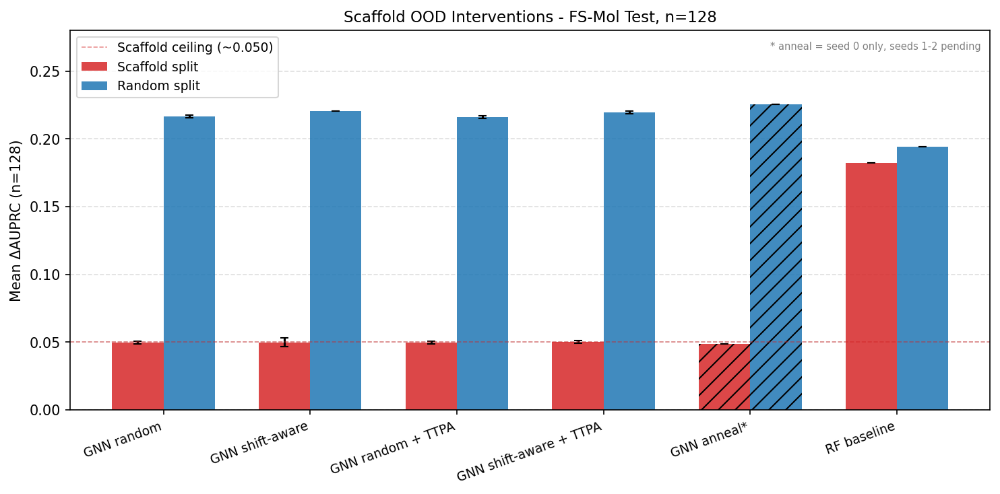

# Prototypical Networks for Molecular OOD Property Prediction

Few-shot molecular property prediction with out-of-distribution (OOD) generalisation, evaluated on two benchmarks: FS-Mol and DrugOOD.

- **Pretraining:** FS-Mol (~26k assays from ChEMBL), episodic training
- **Evaluation:** DrugOOD benchmark (scaffold, size, and assay distribution shift) + FS-Mol held-out test set
- **Task:** Predict activity (pIC50) for molecules from unseen chemical distributions using a small support set
- **Primary metric:** ΔAUPRC = AUPRC(model) − fraction_actives (0 = random classifier, higher = better)

---

## Background

Standard Prototypical Networks (Snell et al., 2017) are designed for few-shot classification. This project implements two prediction heads:

**Regression head** - Nadaraya-Watson kernel regression in learned embedding space:

$$\hat{y}_q = \sum_{i \in \text{support}} \frac{\exp(-d(f(x_q), f(x_i)) / \tau)}{\sum_j \exp(-d(f(x_q), f(x_j)) / \tau)} \cdot y_i$$

**Classification head** - Binary active/inactive prototypes (BCE loss). Labels are pre-binarised ChEMBL `Property` field (0/1).

The embedding function $f$ is trained episodically on FS-Mol with **shift-aware episodes**: support and query molecules come from different Bemis-Murcko scaffold families within the same assay. The pretrained model is then evaluated **zero-shot** on DrugOOD.

---

## Design Choices

| Component | Implemented | Notes |
|---|---|---|
| Encoders | ECFP4 (2048-bit) MLP; FS-Mol GNN 10-layer | GNN uses FS-Mol featurisation |
| Heads | Regression (kernel regression, MSE); Classification (binary PN, BCE) | 3 runs completed |
| Training splits | Shift-aware (scaffold OOD episodes) | Consistent across all runs |
| Distance | Euclidean (training); Mahalanobis with shrinkage (eval) | FS-Mol paper uses Mahalanobis throughout |
| Primary metric | ΔAUPRC = AUPRC(model) − fraction_actives | FS-Mol paper convention |
| Evaluation | Zero-shot (frozen encoder) on DrugOOD + FS-Mol test | No fine-tuning |

---

## Repository Structure

```
PTN/
├── config.py          # Central path config - edit ENV to switch environments
├── main.py            # Full pipeline entry point
├── model.py           # Encoders + prototypical network heads
├── data.py            # Data loading and episode construction
├── train.py           # Episodic pretraining loop
├── evaluate.py        # Zero-shot evaluation (DrugOOD + FS-Mol test)
├── featurize.py       # GNN atom/bond featurisation and degree histogram
├── requirements.txt
│
├── Analysis/
│   ├── data/          # Dataset audit scripts → see Analysis/data/README.md
│   └── model/         # Result plotting and baselines → see Analysis/model/README.md
│
├── data/
│   ├── fsmol/
│   │   ├── train/     # ~26,868 .jsonl.gz assay files
│   │   ├── valid/     # 40 .jsonl.gz assay files
│   │   └── test/      # 157 .jsonl.gz assay files
│   └── drugood/
│       ├── lbap_core_ic50_scaffold.json
│       ├── lbap_core_ic50_size.json
│       └── lbap_core_ic50_assay.json
│
├── checkpoints/       # One .pt file per (encoder, head, split) combination
└── outputs/
    ├── figures/
    │   ├── {run_tag}/         # fig2a, fig2b, fig3 per run
    │   └── data_analysis/     # fig1a/b/c, scaffold diversity, t-SNE
    └── results/
        ├── {run_tag}/         # drugood_results, fsmol_test_results, inside_task_ood, predictions CSVs
        └── data_analysis/     # assay_sizes, data_loss, scaffold_diversity, diagnostic_baseline
```

---

## Training Configuration

| Regime | Runs | Training pool | Notes |
|---|---|---|---|
| **Pool-based** | Run 1 (ECFP regression) | ~62 assays | Legacy run; severely limited task diversity |
| **Streaming** | Runs 2–4 (ECFP classification + GNN) | All ~26,868 FS-Mol train assays | Matches FS-Mol paper; full task diversity |

Run 1 is kept as a legacy ECFP regression baseline. Runs 2–4 all stream from the full 26k training assays and are directly comparable.

---

## Results Summary

All values are mean ΔAUPRC on the FS-Mol held-out test set (157 assays after filtering, 5 repeats per assay per support size). Seeded runs report mean ± std over 3 independent seeds (0, 1, 2). Single-seed runs are legacy baselines.

> **N-assay note:** At n=256 only 29/154 qualifying assays remain (need ≥256 molecules after filtering); at n=512 only 11. These smaller subsets are harder large-assays - the drop at n=256/512 partly reflects assay selection bias, not model failure. N is reported alongside each result.

---

### FS-Mol Test - Mean ΔAUPRC (Random Split)

| Model | Seeds | n=16 (N=154) | n=32 (N=154) | n=64 (N=153) | n=128 (N=148) | n=256 (N=29) | n=512 (N=11) | Best val ΔAUPRC |
|---|---|---|---|---|---|---|---|---|
| *RF baseline (per-task, fixed params)* | - | *0.094* | *0.122* | *0.152* | *0.194* | *0.154* | *0.187* | *-* |
| ECFP · regression · shift-aware *(legacy)* | 1 | 0.028 | 0.033 | 0.041 | 0.062 | 0.065 | 0.056 | RMSE 0.527 |
| **ECFP · classification · shift-aware** | **3** | **0.121 ± 0.001** | **0.137 ± 0.001** | **0.158 ± 0.001** | **0.181 ± 0.003** | **0.078 ± 0.013** | **0.068 ± 0.009** | **+0.166 ± 0.005** |
| **ECFP · classification · random** | **3** | **0.123 ± 0.002** | **0.139 ± 0.001** | **0.157 ± 0.002** | **0.183 ± 0.001** | **0.076 ± 0.002** | **0.066 ± 0.005** | **+0.173 ± 0.002** |
| **FS-Mol GNN · classification · shift-aware** | **3** | **0.127 ± 0.002** | **0.155 ± 0.001** | **0.184 ± 0.001** | **0.220 ± 0.000** | **0.152 ± 0.003** | **0.157 ± 0.003** | **+0.208 ± 0.002** |
| **FS-Mol GNN · classification · random** | **3** | **0.130 ± 0.001** | **0.158 ± 0.001** | **0.188 ± 0.002** | **0.226 ± 0.001** | **0.149 ± 0.001** | **0.166 ± 0.003** | **+0.215 ± 0.004** |
| *FS-Mol paper (GNN + ProtoNet)* | - | *0.126* | *-* | *0.185* | *0.201* | *0.226* | *-* | *-* |

> **RF baseline:** per-task RandomForestClassifier (n\_estimators=100, max\_depth=10, max\_features="sqrt", min\_samples\_leaf=2) on 2048-bit ECFP fingerprints. No meta-learning - trained fresh on each context set. N=153/147 assays at n=16/128 (slightly fewer than ProtoNet due to stricter class-balance check).

### FS-Mol Test - Mean ΔAUPRC (Scaffold Split)

| Model | Seeds | n=16 | n=32 | n=64 | n=128 | n=256 (N=29) | n=512 (N=11) |
|---|---|---|---|---|---|---|---|
| *RF baseline (per-task, fixed params)* | - | *0.079* | *0.101* | *0.129* | *0.182* | *0.135* | *0.189* |
| ECFP · regression · shift-aware *(legacy)* | 1 | 0.018 | 0.018 | 0.019 | 0.019 | 0.003 | −0.003 |
| **ECFP · classification · shift-aware** | **3** | **0.057 ± 0.007** | **0.054 ± 0.006** | **0.051 ± 0.006** | **0.057 ± 0.008** | **0.005 ± 0.001** | **0.001 ± 0.008** |
| **ECFP · classification · random** | **3** | **0.058 ± 0.005** | **0.053 ± 0.005** | **0.054 ± 0.006** | **0.059 ± 0.004** | **0.008 ± 0.003** | **0.006 ± 0.001** |
| **FS-Mol GNN · classification · shift-aware** | **3** | **0.053 ± 0.003** | **0.052 ± 0.002** | **0.052 ± 0.003** | **0.052 ± 0.003** | **0.014 ± 0.001** | **0.008 ± 0.002** |
| **FS-Mol GNN · classification · random** | **3** | **0.051 ± 0.001** | **0.053 ± 0.001** | **0.052 ± 0.001** | **0.051 ± 0.001** | **0.012 ± 0.003** | **0.010 ± 0.003** |

### FS-Mol Test - Mean ΔAUPRC (Size Split)

| Model | Seeds | n=16 | n=32 | n=64 | n=128 | n=256 (N=29) | n=512 (N=11) |
|---|---|---|---|---|---|---|---|
| **ECFP · classification · shift-aware** | **3** | **0.104 ± 0.001** | **0.120 ± 0.002** | **0.130 ± 0.001** | **0.128 ± 0.002** | **0.031 ± 0.009** | **0.042 ± 0.009** |
| **ECFP · classification · random** | **3** | **0.106 ± 0.003** | **0.120 ± 0.002** | **0.129 ± 0.001** | **0.131 ± 0.001** | **0.034 ± 0.004** | **0.040 ± 0.009** |
| **FS-Mol GNN · classification · shift-aware** | **3** | **0.103 ± 0.001** | **0.122 ± 0.004** | **0.142 ± 0.004** | **0.144 ± 0.004** | **0.071 ± 0.002** | **0.107 ± 0.004** |
| **FS-Mol GNN · classification · random** | **3** | **0.107 ± 0.002** | **0.128 ± 0.001** | **0.149 ± 0.002** | **0.153 ± 0.002** | **0.075 ± 0.001** | **0.107 ± 0.003** |

### Inside-Task OOD and DrugOOD

Inside-task OOD: support and query from different scaffold groups within the same assay. DrugOOD: mean ΔAUPRC on `ood_test`, averaged across context sizes 16–512.

| Model | Seeds | Inside-task | DrugOOD assay | DrugOOD scaffold | DrugOOD size |
|---|---|---|---|---|---|
| ECFP · regression · shift-aware *(legacy)* | 1 | 0.041 | 0.008 | 0.000 | 0.016 |
| **ECFP · classification · shift-aware** | **3** | **0.021 ± 0.000** | **0.015 ± 0.007** | **0.004 ± 0.004** | **0.006 ± 0.002** |
| **ECFP · classification · random** | **3** | **0.018 ± 0.001** | **0.016 ± 0.005** | **0.016 ± 0.003** | **0.018 ± 0.006** |
| **FS-Mol GNN · classification · shift-aware** | **3** | **0.021 ± 0.001** | **0.043 ± 0.003** | **0.026 ± 0.005** | **0.020 ± 0.002** |
| **FS-Mol GNN · classification · random** | **3** | **0.018 ± 0.001** | **0.033 ± 0.002** | **0.025 ± 0.002** | **0.028 ± 0.003** |

### Per-Seed Breakdown (3-Seed Runs)

**ECFP · classification · random**

| Seed | Best val ΔAUPRC | Stopped | n=16 | n=128 (random) | n=128 (scaffold) |
|---|---|---|---|---|---|
| 0 | +0.1754 | ep 48 (early stop) | 0.121 | 0.185 | 0.054 |
| 1 | +0.1705 | ep 80 (early stop) | 0.126 | 0.183 | 0.063 |
| 2 | +0.1725 | ep 100 (full) | 0.124 | 0.182 | 0.061 |
| **mean ± std** | **+0.173 ± 0.002** | | **0.123 ± 0.002** | **0.183 ± 0.001** | **0.059 ± 0.004** |

**ECFP · classification · shift-aware**

| Seed | Best val ΔAUPRC | Stopped | n=16 | n=128 (random) | n=128 (scaffold) |
|---|---|---|---|---|---|
| 0 | +0.1615 | ep 43 (early stop) | 0.122 | 0.184 | 0.048 |
| 1 | +0.1659 | ep 50 (early stop) | 0.122 | 0.181 | 0.062 |
| 2 | +0.1719 | ep 88 (early stop) | 0.119 | 0.178 | 0.062 |
| **mean ± std** | **+0.166 ± 0.005** | | **0.121 ± 0.001** | **0.181 ± 0.003** | **0.057 ± 0.008** |

**FS-Mol GNN · classification · random**

| Seed | Best val ΔAUPRC | Stopped | n=16 | n=128 (random) | n=128 (scaffold) |
|---|---|---|---|---|---|
| 0 | +0.2092 | ep 100 (full) | 0.131 | 0.228 | 0.051 |
| 1 | +0.2173 | ep 100 (full) | 0.129 | 0.226 | 0.050 |
| 2 | +0.2190 | ep 100 (full) | 0.130 | 0.225 | 0.053 |
| **mean ± std** | **+0.215 ± 0.004** | | **0.130 ± 0.001** | **0.226 ± 0.001** | **0.051 ± 0.001** |

**FS-Mol GNN · classification · shift-aware**

| Seed | Best val ΔAUPRC | Stopped | n=16 | n=128 (random) | n=128 (scaffold) |
|---|---|---|---|---|---|
| 0 | +0.2091 | ep 100 (full) | 0.129 | 0.220 | 0.055 |
| 1 | +0.2053 | ep 100 (full) | 0.127 | 0.220 | 0.052 |
| 2 | +0.2091 | ep 100 (full) | 0.126 | 0.220 | 0.049 |
| **mean ± std** | **+0.208 ± 0.002** | | **0.127 ± 0.002** | **0.220 ± 0.000** | **0.052 ± 0.003** |

**FS-Mol GNN · classification · ratio-anneal** *(novel contribution - seed 0 only, seeds 1-2 pending)*

| Seed | Best val ΔAUPRC | Best epoch | n=16 | n=128 (random) | n=128 (scaffold) |
|---|---|---|---|---|---|
| 0 | +0.2084 | ep 98 (ratio=0.59) | 0.127 | 0.225 | 0.049 |

> Ratio annealing: scaffold episode fraction linearly increased 0.0→0.60 over 100 epochs. See [train.py](train.py) `pretrain_classification_anneal`.

---

### Scaffold OOD: Intervention Results

Three independent interventions were tested to address the scaffold ΔAUPRC gap. All produced null results (GNN encoder, n=128 support):

| Intervention | Training | Scaffold ΔAUPRC | Random ΔAUPRC | Notes |
|---|---|---|---|---|
| Baseline | random episodes | 0.0495 | 0.2166 | 3-seed avg |
| Baseline | shift-aware episodes | 0.0499 | 0.2203 | 3-seed avg |
| **TTPA** | random + test-time reweight | **0.0499** | **0.2160** | 3-seed avg; +0.0004 gain (noise) |
| **TTPA** | shift-aware + test-time reweight | **0.0502** | **0.2196** | 3-seed avg; +0.0003 gain (noise) |
| **Ratio annealing** | 0%→60% scaffold curriculum | **0.0486** | **0.2252** | seed 0 only |
| *RF baseline* | *per-task supervised* | *0.182* | *0.194* | *no meta-learning* |

**TTPA** (Test-Time Prototype Adaptation): at inference, reweights each support molecule's contribution to the prototype by its mean binary Tanimoto similarity to the query set. Training-free, runs on existing checkpoints. Code: [evaluate.py](evaluate.py), [Analysis/model/run_ttpa.py](Analysis/model/run_ttpa.py).

**Ratio annealing**: starts with 100% random episodes, linearly increases scaffold-split fraction to 60% during training. Per-epoch annealing via `shift_aware_ratio` attribute on the dataset. Code: [train.py](train.py) `pretrain_classification_anneal`, `TRAINING_SPLIT = "anneal"` in [main.py](main.py).

**Conclusion**: The scaffold ΔAUPRC ceiling (~0.050) is structural - intrinsic to the mean-prototype inference mechanism. Neither test-time adaptation nor training curriculum changes can overcome it. The failure mode is that support molecules (same scaffold family) produce a prototype in the wrong region of embedding space relative to OOD query scaffolds, and this cannot be corrected by reweighting or by changing the training distribution.

**Figure** (run `python Analysis/model/plot_interventions.py` to regenerate):



---

### Key Observations

- **GNN random is the best model on FS-Mol**: FS-Mol GNN (random episodes, 3 seeds) peaks at ΔAUPRC **0.226 ± 0.001** at n=128, exceeding the FS-Mol paper's 0.201 at that support size and matching the paper's n=256 number (0.226) one step earlier.
- **Episode type (shift-aware vs random) barely affects FS-Mol test score**: ECFP shift-aware 0.181 ± 0.003 vs ECFP random 0.183 ± 0.001 at n=128; GNN shift-aware 0.220 ± 0.000 vs GNN random 0.226 ± 0.001. The gain from richer encoder architecture dominates any episode-type effect.
- **Shift-aware training improves DrugOOD cross-dataset generalisation**: GNN shift-aware achieves 0.043 ± 0.003 on DrugOOD assay OOD vs GNN random 0.033 ± 0.002 - a ~30% gain. Training on scaffold-OOD episodes transfers to cross-dataset OOD even when it barely moves the FS-Mol in-distribution score.
- **GNN maintains performance at large n**: GNN random holds 0.149 at n=256 and 0.166 at n=512, whereas ECFP random collapses to 0.076 and 0.066. The GNN's structural representations are robust to the large-support regime; ECFP prototypes degrade.
- **Streaming over all 26k assays matters enormously**: ECFP pool-based (Run 1, ~62 assays) reaches 0.062 at n=128; ECFP streaming (any episode type) reaches ~0.183 - a 3× gain purely from training data diversity.
- **RF baseline reveals ProtoNet's scaffold OOD failure**: On random split, GNN ProtoNet (0.226 at n=128) clearly beats RF (0.194) - meta-learning adds value when context and query share scaffolds. On scaffold split, the picture reverses: RF (0.182 at n=128) outperforms all ProtoNet variants (~0.051–0.059). A per-task RF trained fresh on the context set adapts to the task's SAR directly, while ProtoNet's meta-learned embedding space fails to generalise across scaffold boundaries. This confirms scaffold OOD is a fundamental limitation of the embedding approach, not a data-size or encoder issue.
- **Scaffold split is universally hard for ProtoNet**: All ProtoNet variants plateau at ~0.051–0.059 at n=16–128, then collapse at n=256 (~0.005–0.014). Encoder choice and episode type make negligible difference. The RF does not collapse here (0.135 at n=256), pinpointing the prototype-based inference mechanism as the bottleneck.
- **GNN DrugOOD assay OOD is clearly better than ECFP**: GNN shift-aware 0.043 ± 0.003 vs ECFP shift-aware 0.015 ± 0.007 - roughly 3× gain. Structural features transfer better across assay boundaries than fingerprints.
- **Three interventions all null on scaffold**: TTPA (+0.0004), shift-aware training (+0.000), and ratio annealing (seed 0: -0.001) all land at the same ~0.050 scaffold ceiling. The failure is not addressable by test-time adaptation or training curriculum design - it is structural to the mean-prototype mechanism.
- **Low variance across seeds**: std ≤ 0.005 for all models on random split. Results are reproducible.
- **n=256/512 drop is partially assay selection bias**: At n=256 only 29 qualifying assays remain (vs 154 at n=16). These large assays are harder - the drop reflects both a harder subset and (for ECFP) a genuine representation limit.

For full per-assay distributions, per-context-size DrugOOD curves, and baseline comparisons, see [Analysis/model/README.md](Analysis/model/README.md). 

For dataset statistics, see [Analysis/data/README.md](Analysis/data/README.md).

---

## Setup

### Requirements

```
torch>=2.0.0
torch-geometric>=2.3.0
numpy>=1.24.0
rdkit>=2023.3.1
scipy>=1.10.0
scikit-learn>=1.3.0
pandas>=2.0.0
matplotlib>=3.7.0
psutil
```

```bash
pip install -r requirements.txt
```

### Data

**FS-Mol** - Download from [microsoft/FS-Mol](https://github.com/microsoft/FS-Mol). Extract to `data/fsmol/`. Each file is one ChEMBL assay; the loader reads precomputed ECFP fingerprints and log-transformed labels directly.

**DrugOOD** - Three IC50 files from the DrugOOD benchmark:
```
data/drugood/
├── lbap_core_ic50_scaffold.json
├── lbap_core_ic50_size.json
└── lbap_core_ic50_assay.json
```

### Environment

Edit `config.py` - change only `ENV`:
```python
ENV = "local"    # "server" for HPC/server runs
```

---

## Running

```bash
# Full pipeline (train + evaluate) - configure MODEL_HEAD/ENCODER/TRAINING_SPLIT in main.py first
python main.py

# Generate figures from saved CSVs
python Analysis/model/plot_results.py --run_tag fsmol_gnn_classification_shift_aware

# Data analysis (no model needed)
python Analysis/data/dataset_overview.py
python Analysis/data/scaffold_analysis.py
```

---

## References

- Snell et al. (2017) - [Prototypical Networks for Few-shot Learning](https://arxiv.org/abs/1703.05175)
- Stanley et al. (2021) - [FS-Mol: A Few-Shot Learning Dataset of Molecules](https://openreview.net/forum?id=701FtuyLlAd)
- Ji et al. (2022) - [DrugOOD: Out-of-Distribution Dataset Curator and Benchmark for AI-Aided Drug Discovery](https://arxiv.org/abs/2201.09637)
- Corso et al. (2020) - [Principal Neighbourhood Aggregation for Graph Nets](https://arxiv.org/abs/2004.05718)
- 